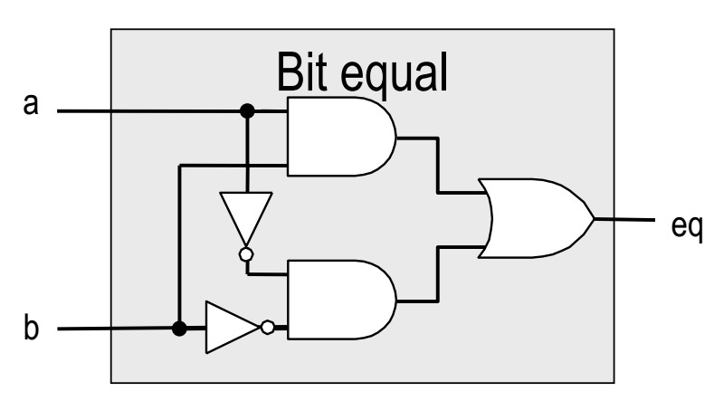
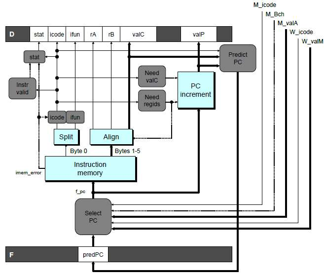
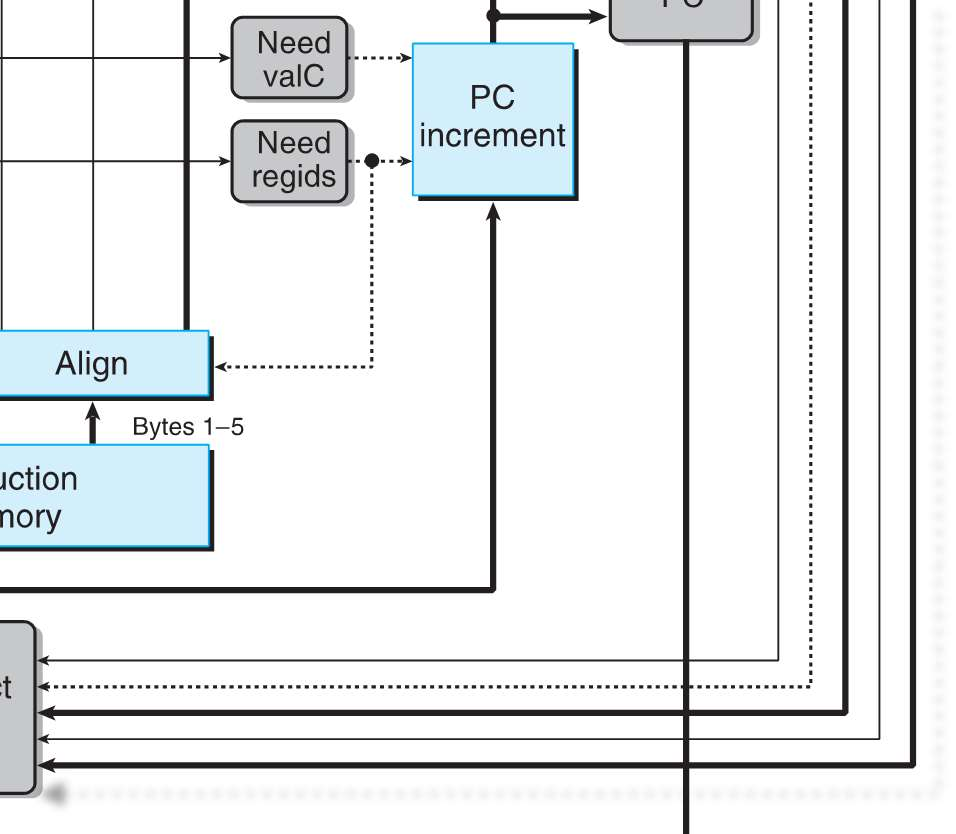

# 2016期中-带答案

> 来源：`往年题/期中/2016期中-带答案.pdf`　共 16 页

<!-- ===== page 1 ===== -->

北京大学信息科学技术学院考试试卷
考试科目：计算机系统导论 姓名：          学号：
考试时间： 2016 年 11 月 07 日 小班教师:
题号  一  二  三  四  五  总分
分数
装
订 阅卷人
线
内   北京大学考场纪律
     1、考生进入考场后，按照监考老师安排隔位就座，将学生证放在桌面上。
    无 学生证者不能参加考试；迟到超过15分钟不得入场。在考试开始30分钟后
    方可交卷出场。
     2、除必要的文具和主考教师允许的工具书、参考书、计算器以外，其它
    所 有物品（包括空白纸张、手机、或有存储、编程、查询功能的电子用品等）
   不 得带入座位，已经带入考场的必须放在监考人员指定的位置。
    3、考试使用的试题、答卷、草稿纸由监考人员统一发放，考试结束时收
   回，一律不准带出考场。以若下有试以题下印为制答问题题纸请，向监共考  教  师页提 出，不得向其他考
生 询问。提前答完试卷，应举手示意请监考人员收卷后方可离开；交卷后不得
不 在考场内逗留或在附近高声交谈。未交卷擅自离开考场，不得重新进入考场答
要 卷 。考试结束时间到，考生立即停止答卷，在座位上等待监考人员收卷清点后，
答 方 可离场。
  4、考生要严格遵守考场规则，在规定时间内独立完成答卷。不准交头接
题 耳 ，不准偷看、夹带、抄袭或者有意让他人抄袭答题内容，不准接传答案或者
  试卷等。凡有违纪作弊者，一经发现，当场取消其考试资格，并根据《北京大
学本科考试工 作与学术规范条例》及相关规定严肃处理。
5、考生须 确认自己填写的个人信息真实、准确，并承担信息填写错误带
来的一切责任与后果。
学校倡议 所有考生以北京大学学生的荣誉与诚信答卷，共同维护北京大
学的学术声誉 。
以下为试题和答题纸，共    页。
1

<!-- ===== page 2 ===== -->

得分
第一题 单项选择题和填空题（每小题1分，共20分）
注：选择题的回答填写在下表中，填空题的回答填写在题目提供的空格中。
题号  1  2  3  4  5  6  7  8  9  10
回答
题号  11  12  13  14  15  16  17  18  19  20
回答          /  /  /  /  /  /
1.  在下列指令中，其执行会影响条件码中的CF位的是：
A. jmp NEXT    B. jc NEXT  C. inc %bx  D. shl $1,%ax
答案：D
2.  下列关于比较指令CMP说法中，正确的是：
A. 专用于有符号数比较    B. 专用于无符号数比较
C. 专用于串比较       D. 不区分比较的对象是有符号数还是无符号数
答案：D
3.  在如下代码段的跳转指令中，目的地址是：
400020: 74 F0   je ________
400022: 5d   pop %rbp
A. 400010   B. 400012   C. 400110   D. 400112
答案：B（有符号跳转，向后跳转-0x10）
4.  对于如下的C语言中的条件转移指令，它所对应的汇编代码中至少包含几条条
件转移指令：if (a > 0 && a != 1 || a < 0 && a != -1) b=a;
A. 2条     B. 3条     C. 4条   D. 5条
答案：B（这个条件相当于!(a==0 || a==1 || a==-1)）
5.  将AX清零，下列指令错误的是（ ）
A. sub %ax, %ax      B. xor %ax, %ax
C. test %ax, %ax     D. and $0, %ax
答案：C（test相当于and）
2

<!-- ===== page 3 ===== -->

6.  在如下switch语句对应的跳转表中，哪些标号没有出现在分支中（ ）
addq $1, %rdi
cmpq $8, %rdi
ja .L2
jmp *.L4(, %rdi, 8)
.L4:  .quad .L9   .quad .L5   .quad .L6   .quad .L7
   .quad .L2
   .quad.L7    .quad .L8   .quad .L2   .quad .L5
A. 3, 6      B. -1, 4      C. 0, 7    D. 2, 4
答案：A
7.  已知短整型数组S的起始地址和下标i分别存放在寄存器%rdx和%rcx，将
&S[i]存放在寄存器%rax中所对应的汇编代码是（ ）
A. leaq (%rdx, %rcx, 1), %rax   B.movw (%rdx, %rcx, 2), %rax
C. leaq (%rdx, %rcx, 2), %rax   D.movw (%rdx, %rcx, 1), %rax
答案：C
8.  下面对指令系统的描述中，错误的是：（  ）
A. CISC 指令系统中的指令数目较多，有些指令的执行周期很长；而 RISC
指令系统中通常指令数目较少，指令的执行周期都较短。
B. CISC指令系统中的指令编码长度不固定；RISC指令系统中的指令编码长
度固定，这样使得CISC机器可以获得了更短的代码长度。
C. CISC指令系统支持多种寻址方式，RISC指令系统支持的寻址方式较少。
D. CISC机器中的寄存器数目较少，函数参数必须通过栈来进行传递；RISC
机器中的寄存器数目较多，只需要通过寄存器来传递参数，避免了不必要的存
储访问。
答案：D
9.  下面对流水线技术的描述，正确的是：（      ）
A. 流水线技术不仅能够提高执行指令的吞吐率，还能减少单条指令的执行时
间。
B. 不断加深流水线级数，总能获得性能上的提升。
C. 流水级划分应尽量均衡，吞吐率会受到最慢的流水级影响。
D. 指令间的数据相关可能会引发流水线停顿，但总是可以通过调度指令来解
决。
3

<!-- ===== page 4 ===== -->

答案：C
10. 对应下述组合电路的正确HCL表达式为：
A. Bool eq = ( a or b ) and ( !a or !b )
B. Bool eq = ( a and b) or ( !a and !b )
C. Bool eq = ( a or !b ) and ( !a or b )
D. Bool eq = ( a and !b ) or ( !a and b )
答案： B
11. 流水线数据通路中的转移预测策略为总是预测跳转。如果转移预测错误，需要
恢复流水线，并从正确的目标地址开始取值。其中，用来判断转移预测是否正
确的信号是_①_和_②__，用来获得正确的目标地址的信号是_③_。
A．① M_icode  ② M_Bch ③ M_valA
B．① W_icode  ② M_Bch ③ M_valA
C．① W_icode  ② M_Bch ③ W_valM
D．① M_icode  ② M_Bch ③ W_valM
答案：A
12. 若处理器实现了三级流水线，每一级流水线实际需要的运行时间分别为 1ns、
2ns 和 3ns，则此处理器不停顿地执行完毕 10 条指令需要的时间为：
A． 21 ns  B． 12 ns  C． 24 ns  D． 36 ns
4

<!-- ===== page 5 ===== -->

答案 D  3+3+10*3=36ns
13. 以下关于存储结构的讨论，那个是正确的
A. 增加额外一级存储，数据存取的延时一定不会下降
B. 增加存储的容量，数据存取的延时一定不会下降
C. 增加额外一级存储，数据存取的延时一定不会增加
D. 以上选项都不正确
答：（      ）
答案: D
14. 关于局部性（locality）的描述，不正确的是：
A. 循环通常具有很好的时间局部性
B. 循环通常具有很好的空间局部性
C. 数组通常具有很好的时间局部性
D. 数组通常具有很好的空间局部性
答案：C
数组本身只能体现出空间局部性
15. 假定编译器规定int和short型长度分别为32位和16位，执行下列语句：
unsigned short x = 65530;
unsigned int y = x;
得到y的机器数为___________。（用16进制表示，勿省略前导的0）
答案：0000FFFA
解析：x的机器数是FFFA
      y的机器数是0000FFFA，注意无符号数使用零扩展
16. 一个C语言程序在一台32位机器上运行。程序中定义了三个变量x、y和z，
其中x和z为int型，y为short型。当x=127，y=-9时，执行赋值语句
z=x+y后，z的值是__________（用16进制表示，勿省略前导的0）
答案：00000076
解析：x的机器数是0000007F
      y的机器数是FFF7，和int型运算时符号扩展为FFFFFFF7
      z的机器数是0000007F+FFFFFFF7=00000076（最高位进位自
然丢弃）
      也可直接由127-9=118得到结果
17. 若按IEEE浮点标准的单精度浮点数（符号位1位，阶码字段exp占据8位，
5

<!-- ===== page 6 ===== -->

小数字段frac占据23位）表示-8.25，结果是__________（用16进制
表示）
答案：C1040000
解析： 8.25(1)*23*(1 1)
32
      符号位：1
      阶码字段：1000 0010(127+3=130)
      小数字段：000 0100 0000 0000 0000 0000(1/32)
      结果：1100 0001 0000 0100 0000 0000 0000 0000
18. 若我们采用基于IEEE浮点格式的浮点数表示方法，阶码字段exp占据k位，
小数字段frac占据n位,则最大的非规格的正数是__________（结果用含
有n,k的表达式表示）
n 2k12
答案：(12 )*2
解析：阶码字段exp：00...00
      小数字段frac：11...11
      偏置值bias:2k11
19. 如果直接映射高速缓存大小是4KB，并且块（block）大小为32字节，那么
它每组（set）有          行（line）。
答案：1。这是直接映射高速缓存的基本特征，和容量无关
20. 如果直接映射高速缓存大小是4KB，并且块（block）大小为32字节，那么
它每路（way）有          行（line）。
答案：128，容量=路容量*路数=cache 行大小*Set 数*路数->set 数
=4KB/32B=27=128
6

<!-- ===== page 7 ===== -->

得分
第二题（20分）
（边凯归，周明辉）
1.在64位机器上，判断下列等式是否恒成立
/* random_int()函数返回一个随机的int类型值 */
int x = random_int();
int y = random_int();
int z = random_int();
unsigned ux = (unsigned)x;
long lx = (long)x;  /* long为64位 */
long ly = (long)y;
double dx = (double)x;
double dy = (double)y;
double dz = (double)z;
Expression  Always True?
(x >= 0) || (3*x < 0)  Y     N
(x >= 0) || (x < ux)  Y     N
((x >> 1) << 1) <= x  Y     N
((x-y)<<3) + (x>>1) - y == 8*x - 9*y + x/2  Y     N
(x - y > 0)  ==   ((y+~x+1)>>31 == 1)  Y     N
dx + dy == (double) (y+x)  Y     N
dx + dy + dz == dz + dy + dx  Y     N
(int)((lx+ly)>>1)   ==   ((x&y) +  Y     N
((x^y)>>1))
（前6题每题1分; 7、8两题每题2分; 共10分）
答案
N  考虑 x = (1<<31)>>1
N  考虑 x = -1
Y
N  考虑 x = -1  y = 0
N  考虑x-y = Tmin
7

<!-- ===== page 8 ===== -->

N  考虑x+y溢出
Y  恒成立,每一个int型都可以由一个double型精确表示
Y  恒成立
2. 假设C语言中新定义了一种数据类型T,该类型为12-bit长的浮点数，此浮
点数遵循IEEE浮点数格式，其字段划分如下：
符号位（s）：1-bit；阶码字段（exp）：6-bit；小数字段（frac）：5-bit。
1) 若将该格式下能表示的所有正规格数从小到大依次排列，则
相邻两数之间差值的最小值为_________
相邻两数之间差值的最大值为_________
2) 现定义了如下变量：
T a = -15.875;
T b = (1<<28) + (1<<24) + (1<<22);
T c = a*b;
请写出各变量的二进制表示：
变量  二进制表示
a
b
c
（每空2分; 共10分）
答案：
1）
2-35
226
2）
1 100011 00000 (发生进位)
0 111011 00010 (发生舍入)
1 111111 00000 (溢出，+∞)
8

<!-- ===== page 9 ===== -->

得分
第三题（20分）
（出题人：熊英飞，审核人：陈钟、焦文品）
(1) 观察下面C语言函数和它相应的X86-64汇编代码
int foo(int x, int i)
{
switch(i)
{
case 1:
x -= 10;
case 2:
x *= 8;
break;
case 3:
x += 5;
case 5:
x /= 2;
break;
case 0:
x &= 1;
default:
x += i;
}
return x;
}
00000000004004a8 <foo>:
4004a8: mov %edi,%edx
4004aa: cmp $0x5,%esi
4004ad: ja 4004d4 <foo+0x2c>
4004af: mov %esi,%eax
4004b1: jmpq *0x400690(,%rax,8)
4004b8: sub $0xa,%edx
4004bb: shl $0x3,%edx
4004be: jmp 4004d6 <foo+0x2e>
4004c0: add $0x5,%edx
9

<!-- ===== page 10 ===== -->

4004c3: mov %edx,%eax
4004c5: shr $0x1f,%eax
4004c8: lea (%rdx,%rax,1),%eax
4004cb: mov %eax,%edx
4004cd: sar %edx
4004cf: jmp 4004d6 <foo+0x2e>
4004d1: and $0x1,%edx
4004d4: add %esi,%edx
4004d6: mov %edx,%eax
4004d8: retq
调用gdb命令x/kg $rsp 将会检查从rsp中的地址开始的k个8字节字，请填写下
面gdb命令的输出（每空一分）。
>(gdb) x/6g 0x400690
0x400690: 0x__________________ 0x__________________
0x4006a0: 0x__________________ 0x__________________
0x4006b0: 0x__________________ 0x__________________
(2) 右边的汇编代码是由左边程序中的m函数编译而成。回答如下问题。
t  yspterduecft  s_tlriusctt*  _nleixstt;  {  m : testq  %rdi, %rdi
  int value;    je .L6
} i nlti smt(;l ist* p) {      mmtooevvsqlt  q  %($r%1dr0xd0,i, ) %,%r ed%axrx  dx
    iwnhti lre  =( _1_○010_;_ ) {     jjnmep  ..LL43
    r = __○2__;  .L14:
    p = __○3__;     mtoevsqt q  %(r%drxd,i )%,r d%xr dx
      }ir fe t(upr n! =r ; 0) r = __○4__;   .L4:j e .L3
}     m_o_○v5l_ _ 88((%%rrddxi)),,  %%rr88dd
  __○5__ %r8d, %eax
   mtoevsqt q  %(r%drid,x )%,r d%ir di
   jrneet  .L14
. L3:_ _○5__ 8(%rdi), %eax
 . L6:rm eotv l  $100, %eax
已知访存延迟1个指令周期。不访存的时候  adrdelt 延迟4个指令周期，imull延
10

<!-- ===== page 11 ===== -->

迟 8 个指令周期，其他指令延迟 1个指令周期。指令访存时延迟的执行周期为不
访存的时候延迟的指令周期和访存延迟的周期之和。函数m中的循环在处理链表p
的时候CPE为4个指令周期。○5处的指令为movl, addl, imull中的一个。请
填写○1-○5处的代码（○5空2分，其他3分）。
○1
○2
○3
○4
○5
答案：
(1)每空1分
0x400690:   0x00000000004004d1      0x00000000004004b8
0x4006a0:   0x00000000004004bb      0x00000000004004c0
0x4006b0:   0x00000000004004d4      0x00000000004004c3
(2) ○5空2分，其他3分
○1p != 0 && p->next != 0
○2r * (p->value * p->next->value) 注意：答案中运算可以交换，但不可
结合
○3p->next->next
○4r * p->value
○5imull （因为每次处理两个元素，所以关键路径的时间周期为 8。关键路径要
么为两次访存和两次 mov，要么为○5处的运算。前者不可能达到 8，所以只能是
imull。）
给分说明：如果○2○4的答案和○5一致，但是○5答错了就○2○4各给2分。
11

<!-- ===== page 12 ===== -->

得分
第四题（20分）
（出题人：汪小林，易江芳）
请分析32位的Y86 ISA中新加入的一组条件返回指令：cretXX，其格式如下。
cretXX  9  fun
类似cmovXX，该组指令只有当条件码(Cnd)满足时，才执行函数返回；如果
条件不满足，则顺序执行。
1. 若在教材所描述的SEQ处理器上执行这条指令，请按下表补全每个阶段的操作。
需说明的信号可能会包括：icode, ifun, rA, rB, valA, valB, valC, valE,
valP, Cnd；the register file R[], data memory M[], Program
counter PC, condition codes CC。其中对存储器的引用必须标明字节数。
如果在某一阶段没有任何操作，请填写none指明。
Stage  cretXX Offset
Fetch  icode:ifun  M1[PC]
valP  PC+1
valB  R[%esp]
Decode  valA  R[%esp]
valE  valB + 4
Execute  Cnd ← Cond(CC, ifun)
valM  M4[valA]
Memory
if (Cnd) R[%esp]  valE
Write back
PC update  PC  Cnd ? valM : valP
（每个空1分，共9分）
2.为了执行cretXX指令，我们需要改进教材所描述的PIPE处理器，在W（Write
12

<!-- ===== page 13 ===== -->

Back）阶段引入流水线寄存器___W_Cnd(填W_Bch也算对)__________，并将
其连接到PC选择器（Select PC）以便有条件地更新PC。假设改进后的处理器总
是预测函数返回条件不满足，则如果返回条件满足时，一共会错误取指__3__条指
令。（每空1分，共2分）
3.在2中改进的PIPE处理器上执行cretXX指令时，发生预测错误时的判断条件和
各级流水线寄存器的控制信号应如何设置？
Condition  Trigger
Mispredicted cret  (E_icode = ICRETXX && e_Cnd) ||
(M_icode = ICRETXX && M_Cnd)
（算两个空，每空1分，共2分）
Condition  F  D  E  M  W
Mispredicted cret  Normal  bubble  bubble  normal  normal
（每空1分，共3分）
13

<!-- ===== page 14 ===== -->

4. PIPE处理器上处理器上执行如下代码片段，
0x000:    xorl %eax, %eax
0x002:    popl %esp
0是x否00会4发: 生   lcoraedt-nues e 和misprediction cret组合的hazard情况？（1分）
答：不会
 如果此时“popl %esp”在流水线的Execute阶段，请问此时，各级流水线寄存
器的控制信号应如何设置？
Condition  F  D  E  M  W
Combination  stall  stall  bubble  normal  normal
（  每空1分，共3分）
14

<!-- ===== page 15 ===== -->

得分
第五题（20分）
（孙广宇，陆俊林）
现有一个能够存储4个Block的Cache，每一个Cache Block的长度为2
Byte（既 B = 2）。内存空间的大小是32Byte，既内存空间地址范围如
下：
010  (000002) -- 3110 (111112)
现有一程序，访问内存地址序列如下所示，单位是Byte。
 210  2310  1010  910  910  1110  310
1. Cache的结构如下图所示（S=2， E=2），初始状态为空，替换策略
LRU。请在下图空白处填入上述数据访问后Cache的状态。
（TAG使用二进制格式；Data Block使用10进制格式，例：M[6-7]表示
地址610-710对应的数据）
  V  TAG  Data Block
set0  1  010  M[8-9]
      0
  V  TAG  Block
set1  1  010  M[10-11]
   1  000  M[2-3]
上述数据访问一共产生了多少次Hit: __2__ (2pts)
2. 如果Cache的替换策略改成MRU（即Most Recently Used, 最近使
用的数据被替换出去），请在下图空白处填入访问上述数据访问后Cache
的状态。
  V  TAG  Data Block
15

<!-- ===== page 16 ===== -->

set0  1  010  M[8-9]
      0
  V  TAG  Block
s  et1  1  000  M[2-3]
上述数据访问一共产生了多少1 次H0i1t0： __3___M [(120p-t1s1)]
 3. 现增加一条新规则：地址区间包含5的倍数的block将不会被缓存，仍旧使
用 MRU 替换策略，这7次数据访问一共产生了多少次Hit __2___ (2pts)
 4. 在第3小题的基础上，现又增加一条数据预取规则：每当地址为10的数据被
访问时，地址为8的数据将会被放入缓存，这7次数据访问一共产生了多少次Hit
_ _3___ (2pts)
16
