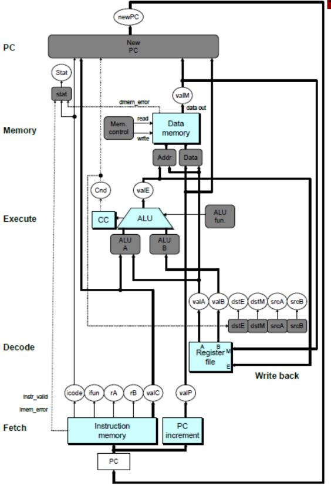

# 2023期中-带答案

> 来源：`往年题/期中/2023期中-带答案.pdf`　共 23 页

<!-- ===== page 1 ===== -->

北京大学信息科学技术学院考试试卷
考试科目：计算机系统导论 姓名：          学号：
考试时间：2023年 11月 6 日   小班号：
题号  一  二  三  四  五  总分
分数
装
阅卷人
订
线
北京大学考场纪律
内
  以下以下为答题纸，共    页
   1、考生进入考场后，按照监考老师安排隔位就座，将学生证放在桌面上。
    无 学生证者不能参加考试；迟到超过15分钟不得入场。在考试开始30分钟后
    方 可交卷出场。
     2、除必要的文具和主考教师允许的工具书、参考书、计算器以外，其它
    所 有物品（包括空白纸张、手机、或有存储、编程、查询功能的电子用品等）
   不 得带入座位，已经带入考场的必须放在监考人员指定的位置。
    3、考试使用的试题、答卷、草稿纸由监考人员统一发放，考试结束时收
   回，一律不准 带出考场。若有试题印制问题请向监考教师提出，不得向其他考
生询问。提前答完试卷，应举手示意请监考人员收卷后方可离开；交卷后不得
不
在考场内逗留或在附近高声交谈。未交卷擅自离开考场，不得重新进入考场答
要 卷。考试结束时 间到，考生立即停止答卷，在座位上等待监考人员收卷清点后，
方可离场。
答
4、考生要严格遵守考场规则，在规定时间内独立完成答卷。不准交头接
题 耳，不准偷看 、夹带、抄袭或者有意让他人抄袭答题内容，不准接传答案或者
  试卷等。凡有违纪作弊者，一经发现，当场取消其考试资格，并根据《北京大
学本科考试工作与学术规范条例》及相关规定严肃处理。
以下为试题和答题纸，共 14 页。
5、考生须确认自己填写的个人信息真实、准确，并承担信息填写错误带
来 的一切责任与后果。
学校倡议所有考生以北京大学学生的荣誉与诚信答卷，共同维护北京大
学的学术声誉。
1

<!-- ===== page 2 ===== -->

得分
第一题 单项选择题（每小题2分，共40分）
注：选择题的回答必须填写在下表中，写在题目后面或其他地方，视为无效。
题号  1  2  3  4  5  6  7  8  9  10
回答  C  D  B  C  D  A  A  C  A  B
题号  11  12  13  14  15  16  17  18  19  20
回答  C  D  A  A  D  E  D  A  D  D
1.假设在C语言中有如下声明：
unsigned u = 0x7FFFFFFF;
int i = 0x80000000;
short s = 0x7FFF;
则下列表达式结果为真的是：
A. i < u
B. -i > i
C. (short)i < s + (int)1
D. (unsigned)s > u
答案：C
考察整型的位级表示。
A 错误。int和unsigned比较时按unsigned计算，此时i比u大1。
B 错误。-i与i的位级表示相同（0x80000000），故它们相等。
C 正确。(short)i做了截断，其值为0。s + 1按int计算，其值为0x00008000。
最后比较时按int计算，左侧仍然是0，从而小于右侧。
D 错误。(unsigned)s 做了符号扩展，由于 s 的最高位为 0，所以扩展后为
0x00007FFF，其值比u小。
2.下列说法中，正确的是：
A．对于int类型的变量x，y，z，在执行z = x * y后可以用z / x == y
来判断乘法运算是否没有发生溢出
B．对于int类型的变量x，(x >> 1) <= x总为真
C．对于int类型的变量x，(x >> 1) == (x / 2)总为真
D．对于int类型的变量x，总存在一个k，使得x & (-x)的结果等于1 << k
2

<!-- ===== page 3 ===== -->

答案：D
考察整型的运算规则。
A 错误。x的值可能为0，需要特别判断。
B 错误。x的值小于-1时，不等式为假，比如(-2)>>1的结果为-1。
C 错误。用算术右移做除法时，结果会往下取整，但除法本身向零取整，比如(-
1)>>1的值是-1，但(-1)/2的值是0。
D 正确。-x等于(~x) + 1，如果x低位有连续k个0，~x的低位就有连续k个
1，-x低位就同样是连续k个0。-x除去低位的k+1位后与~x相同，与x相反。
所以x & (-x)等于1 << k。
3.对于float类型的变量a，b，下列说法正确的是：
A．假设a，b不是NaN，则(a + b) - a == b总为真
B．a的小数字段长度为23位，所以它能精确表示的最小正数是2-149
C．假设a表示的是一个整数，那么(int)a == a总为真
D．假设a不是NaN，则存在b的取值使得a + b == 0为真
答案：B
考察浮点数的位级表示和运算规则。
A 错误。比如a为1e20，b为1.0，a + b会舍入到1e20,(a + b) – a的
结果是0.0。
B 正确。float的位级表示有1个符号位，8位阶码(偏移为127)，23位小数。
所以最小的可精确表达的正数是2-23*21-127=2-149。
C 错误。可能会发生溢出。
D 错误。a的值为无穷大时，不存在这样的b（因为正负无穷相加结果为NaN）。
4. 以下 x86-64 汇编指令中，正确的是
①  movw  $0x40  (%eax)
②  movb  %dl  %sl
③  movb  %spl  %al
④  movq  %rax  %rsi
⑤  movw  (%rcx)  %dx
⑥  movl  %rsp  (%r8)
A.①③⑤
B.②④⑥
C.③④⑤
D.①⑤⑥
3

<!-- ===== page 4 ===== -->

答案：C
5.有如下函数（包含一处空缺，用__表示）:
long func1(long a[][3], long x, long y) {
    return a[x*2+y][__];
}
该函数经gcc –Og编译后得到如下x86-64汇编代码
// x86_64 Linux calling convension
// return: RAX
// parameters: RDI, RSI, RDX, RCX
// sizeof(int) = 4
// sizeof(long) = 8
func1(long (*) [3], long, long):
        leaq    (%rdx,%rsi,2), %rax
        leaq    (%rax,%rax,2), %rax
        movq    48(%rdi,%rax,8), %rax
        ret
则空缺处应为：
A.0
B.2
C.4
D.6
答案：D
6.以下说法中错误的是：
A.cmpq %rsi, %rdi setl %al连续执行这两条指令的效果是如果%rsi的值
小于%rdi，则将%al设置为1。
B.testq %rax, %rax sete %al连续执行这两条指令的效果是如果%rax中
的值等于0，则将%al设置为1。
C.条件传送指令的源和目的操作数可以为16/32/64位寄存器，但是不支持单字
节传送。
D.set*（如sete, setne, seta） 指令中的目的操作数只能是一个低位单字
4

<!-- ===== page 5 ===== -->

节寄存器，该指令会根据条件是否成立将一个字节设置为0或1。
答案：A，应该是%rdi的值小于%rsi，B、C、D正确，具体见CSAPP中对应指令
的定义。
7.考虑在x86-64 + Linux情景，在使用call指令进行过程/函数调用时，计
算机会做如下哪一条描述的事情：
A. 将此call指令的下一条指令的地址放入栈中
B. 将此call指令的下一条指令的地址放入%rsp寄存器中
C. 将此call指令的地址放入栈中
D. 将此call指令的地址放入%rsp寄存器中
答案：A
8.在x86-64架构、Linux操作系统下，有如下C定义。
  struct {
  union {
      short s1;
      char c[3];
  } u;
  double d;
  short s2;
  } s;
考虑使用GCC默认选项进行编译，下列逻辑表达式为真的是：
A. sizeof s.u == 3
B. sizeof s.u == 8
C. (&s.s2 - &s.u.s1) == 8
D. (&s.s2 - &s.u.s1) == 16
答案：C
sizeof s.u应为4。
5

<!-- ===== page 6 ===== -->

 9.在 x86-64 架构、LINUX 操作系统下，有如下 C 定义。那么 sizeof A +
sizeof *A + sizeof **A + sizeof ***A的值为？
   int (*A[2])[3];
A. 40
B. 44
C. 48
D. 84
 答案：A
16 + 8 + 12 + 4 = 40。
 10.二进制有很多奇妙的应用，其中非常经典的一个，就是lowbit运算，即
l owbit(x) = x & (-x)。
问A. x8= 12时候，lowbit(12)计算得到？
B. 4
CD..  02
答案：B
 11. 采用下列的四选一（MUX4）实现HCL表达式：out=（A || C）&& （B ||
C ），连接正确的是：
Word out =  [ !s1&& !s0: I0;   I0
!s1:       I1;  I1 M4U:1X out
!1 s0: :              II32 ;  II23
  ]；  S1 S0
A.S1=A, S0=C, I0= 0, I1= 1，I2=B，I3=0；
B.S1=B, S0=C, I0= 0, I1= 0，I2=A，I3=1；
6

<!-- ===== page 7 ===== -->

C.S1=A, S0=B, I0= C, I1= C，I2=C，I3=1；
D.S1=A, S0=B, I0= C, I1= C，I2=C，I3=0。
答案：C
12.缓冲区溢出不仅会破坏返回地址，也有可能破坏局部变量。在 x86-64 架构、
LINUX操作系统下，对于给出的C代码和汇编代码，下列说法错误的是？
 int foo(char *s) {  int foo(char *s)
     int a = 0x1;  s in %rdi
     char c[4];  foo:
     strcpy(c, s);  55                   push    %rbp
     return a;  48 89 e5              mov     %rsp,%rbp
 }  48 83 ec 20           sub     $0x20,%rsp
   48 89 7d e8           mov     %rdi,-
 int main() {  0x18(%rbp)
     char s[8] = "01234567";  c7 45 fc 01 00 00 00  movl    $0x1,-
     printf("%x\n", foo(s));  0x4(%rbp)
     return 0;  48 8b 55 e8           mov     -
 }  0x18(%rbp),%rdx
  48 8d 45 f8           lea     -
  0x8(%rbp),%rax
  48 89 d6              mov     %rdx,%rsi
  48 89 c7              mov     %rax,%rdi
  e8 cd fe ff ff        call    strcpy
  8b 45 fc              mov     -
  0x4(%rbp),%eax
  c9                    leave
  c3                    ret
A. %rbp被用作帧指针，便于局部变量寻址
B. leave指令具有释放整个栈帧的效果
C. 函数foo的返回值为0x37363534
D. 函数foo的返回地址未被破坏
答案：D
注意字符串结尾有‘\0’。
7

<!-- ===== page 8 ===== -->

13. 在下列类型转换的过程中可能会发生舍入，但绝对不会发生溢出的是：
A. unsigned long long 转 float
B. float 转 unsigned
C. double 转 float
D. int 转 short
答案：A. 类型转换舍入会影响精度，但是溢出则会影响结果，所以在编写程序中
溢出是需要严格避免的，而舍入是可以容忍的。整型浮点型位数多转位数少一定会
溢出，整型和浮点型相互转换是考察的重点
14. 阅读如下一段代码
int a = -15;
unsigned b = 0xfffffff0;
printf("%d", ((int)0x80000001 + a) - ((unsigned)0x80000002 +
b))
请问运行这段代码后的输出是什么：
A. 0
B. 1
C. -2147483647
D. -2147483647 - 1
答案：A. 主要考察two's complement(负数的二进制值)，二进制值和表示方
式的关系（表示方式是对二进制值的解读方法，计算结果与表示方式无关）
15. 已知sizeof操作返回unsigned类型，在某按按字节编址、大端法存储的
机器上运行下面代码，得到的输出为：
char s[16] = "I love ICS2023!";
for (int i = sizeof(s); i - sizeof(char) >= 0; i -= sizeof(char)) {
    printf("%c", s[i - 1]);
}
A. I love ICS2023!
B. !3202SCI evol I
C. 没有输出，程序直接结束
D. 循环不会停止，字符数组越界
答案：D. 主要考察数据类型的隐式转换（sizeof 返回 unsigned，int 和
unsigned的比较和转换是写代码时经常会忽略的），大小端表示方法（干扰考察
点）
8

<!-- ===== page 9 ===== -->

16. 在教材中Y86-64的SEQ实现中，考虑对newPC的HCL描述，第三处填空
③应该填写的正确表述是：
word new_pc = [
    icode  == ICALL :   ①  ;
    icode  == IJxx && Cnd :   ②  ;
    icode  == IRET :   ③  ;
    1  :    ④  ;
];
A. ValA
B. ValB
C. ValC
D. ValE
E. ValM
F. ValP
答案：选E。中文教材P281-282，送分题
17.关于RAM（Random-access memory）和NVM (Non-volatile memory)
表述正确的是:
A. RAM支持随机访问，NVM不支持随机访问；
B. DRAM不能被用来做Cache；
C. NVM不能被用来做主存；
D. 新介质（如3D XPoint）既能作为块设备也能作为字节设备；
E. 与RAM相比，所有NVM都遵循擦除后写（erase before write）的规则；
F. 在磁盘系统的实现中不会使用到DRAM；
正确答案：D，A 中 NVM 支持随机访问，B 中 eDRAM 被用于 L3/L4 缓存，C 中
Optane DC PMM可以被用于主存，E中Optane支持in-place update，F中
磁盘包含32MB-128MB DRAM作为缓存。
18.假设一块32MB缓存、1TB容量的磁盘有如下配置：
Rotation rate = 7200 RPM,
Average seek time = 9 ms,
Average # sectors/track = 400
现磁头处在（Sector 0，Track 0）位置，请问访问（Sector 16，Track 1），
（Sector 48，Track 2），（Sector 32，Track 1），（Sector 16，Track
9

<!-- ===== page 10 ===== -->

1）最短需要花多长时间？（Track 0、1、2在一个zone内）
A. 19.02 ms
B. 11.3 ms
C. 29.3 ms
D. 43.38 ms
E. 35.7 ms
（修订：本题不计分、所有人都给分）
正确答案：A
Transfer time of a sector costs 60 / 7200 x 1 / 400 x 1000
ms/sec = 0.02 ms
Rotation time of a sector costs 1 / 400 x (60 / 7200) x 1000
ms/sec = 0.02 ms
完成最短的访问时间，需要依次访问：（Sector 16，Track 1）（Sector 32，
Track 1）（Sector 48，Track 2），seek time x 2 + rotation time
x (16+16+16) + transfer time x 3 = 18 ms + 0.96 ms + 0.06 ms
= 19.02 ms。
错误答案：B 随便编了一个很小的数，11.3ms。
错误答案：C
依次访问：（Sector 16，Track 1）（Sector 48，Track 2）（Sector 32，
Track 1）（Sector 16，Track 1），seek time x 3 + rotation time
x (16 + 48 + 32 + 16) + transfer time x 3 = 27ms + 2.24ms +
0.06ms = 29.3ms。
错误答案：D
依次访问：（Sector 16，Track 1）（Sector 48，Track 2）（Sector 32，
Track 1）（Sector 16，Track 1），seek time x 3 + rotation time
x (400 + 400 + 16) + transfer time x 3 = 27ms + 16.32ms +
0.06ms = 43.38ms。
错误答案：E
依次访问：（Sector 16，Track 1）（Sector 48，Track 2）（Sector 32，
Track 1），seek time x 3 + rotation time x (400 + 32) + transfer
time x 3 = 27ms + 8.64ms + 0.06ms = 35.7ms。
19.某计算机地址空间 12 位，cache被分为S个组，每组E个cacheline，一
个cacheline长度2b字节。cache的参数为：S=4,E=1,b=4，现在依次访问
4-14-84-114-514-124-84-4(以字节为单位,十进制)，请问cache一共命中
10

<!-- ===== page 11 ===== -->

了次:
A. 0
B. 1
C. 2
D. 3
答案： D
访问的块：0-0-5-7-32-7-5-0
模拟一下得到14,124,第二个84是命中的
20.针对程序优化，下面说法正确的是:
A. 当处理器内部存在多个功能部件空闲时，就可以通过指令并行提高程序性能。
B. 循环展开的原理是将尽量多的循环操作去掉相关性并重组，展开次数越多，代
码性能更好。
C. a和b都是int*，*a+=*b;*a+=*b; 这段代码总是可以用 *a+=(*b)<<1;
代替。
D. 编译器不会将下面的代码自动优化
double ans;
double a[100][100];
for(int j=0;j<100;j++)
   for(int i=0;i<100;i++)
       ans+=a[i][j];
优化成:
double ans;
double a[100][100];
for(int i=0;i<100;i++)
   for(int j=0;j<100;j++)
       ans+=a[i][j];
答案：D
解析：
A. 错误。需要看具体的关键路径
B.  循环展开次数增加会导致代码膨胀、增大寄存器压力，影响性能（课本
5.11.1）。
C. a,b如果指向同一地址则出错
D. 正确，double没有结合律
11

<!-- ===== page 12 ===== -->

12

<!-- ===== page 13 ===== -->

得分
第二题（15分） 请结合教材第二章的相关知识,回答下列问题
量化（Quantization）是将输入值从大集合映射到较小集合中的输出值的过程，
在神经网络中是压缩模型的经典方法，通过降低权重、偏差和激活精度消耗更少的
内存。 量化利用了神经网络对噪声的弹性； 通过使用较低精度的值，量化会引入
一些噪声，但深度神经网络仍然可以学习拾取关键模式并忽略噪声。在 Nvidia
H100 GPU 中引入了对新数据类型 FP8（8 位浮点）的支持，从而实现了更高的
矩阵乘法和卷积吞吐量。FP8包含E4M3和E5M2两种不同的数据类型，E4M3包
含1位符号，4位阶码，3位尾数；E5M2包含1位符号，5位阶码，2位尾数。
（M是mantissa的缩写表示尾数部分，与书本上fraction等价）
   1. 其中E5M2遵守IEEE-754标准，根据所学的float和double的知识，
该数据类型能表示最大的规格化数（二进制）是(1)____；最大的非规格化数（二
进制）是(2)____。
   2. 但是在Nvidia的设计中E4M3放弃了IEEE-754标准，通过回收用于特
殊值的大多数位模式来扩展动态范围，它只保留了阶码(E)和尾数(M)全为1时为
特殊值 NaN，则该数据类型将能表示的最大规格化数扩展到（二进制）
(3)________，值（十进制）是(4)________，是IEEE-754标准设计出的最
大规格化数的(5)________倍（舍入到整数）。因为在这种情况下，实现的更大范
围比支持特殊值的多种编码有用得多。
   3. 另一种 8bit 格式 int8（8bit 整型）在模型量化中占有重要地位。与
float相比，int8在少量精度损失下将模型大小和内存带宽需求降低4倍，使得
模型表示更加紧凑，并且在PyTorch, TensorFlow框架中都有很好的支持。那
么在H100 GPU上用Nvidia E4M3表示int8，是否会发生溢出(6)________
13

<!-- ===== page 14 ===== -->

（请填是/否），是否会发生舍入(7)________（请填是/否）。
   4. 深度学习模型计算会涉及大量浮点数的加法和乘法，而计算顺序对于结果
有很大的影响。要将E5M2表示的-1.25, 1.5, 1/16, 1/32四个浮点数相加，
写出可能得到的最小计算结果（分数）(8)________，最大计算结果（分数）
(9)________。
   5. 在深度学习中，我们期望使用在容忍一定误差的前提下使用内存占用最小
的数据类型，则对于以下一维卷积应当采用(10)________的浮点型（请填
float/double/E4M3/E5M2）
   在训练神经网络期间， 通常前向激活和权重需要更高的精度，因此最好在前向
传递期间使用 E4M3 数据类型。 然而在后向传递中，流经网络的梯度通常不太容
易受到精度损失的影响，但需要更高的动态范围。 因此，最好使用 E5M2 数据格
式存储它们。
答案：
1. 011110112; 000000112 （2分2分）
2. 011111102, 448, 2 （2分 1分 1分）
3. 不会，会 （2分 2分）
4. 1/4, 3/8(向偶数舍入) （1分 1分）
5. E4M3 （1分 1分）
本题在深度学习模型量化压缩的场景下，主要考察对于IEEE-754标准的掌握和对
浮点型指数部分(E)和底数部分(M)对于范围和精度的影响，并拓展考察在实际应用
中浮点数计算顺序和选取适当浮点型的软件程序员需要注意和警惕的问题，引导同
学们深入思考并将ICS的知识真正的学以致用
评分标准修订：
(1) 写1110000000000000(13个0)可以给1分, 原来不得分
14

<!-- ===== page 15 ===== -->

(2) 写0.0000000000000011(算0.总共15个0)可以给1分, 原来不得分
(3) 写111000000(6个0)可以给1分, 原来不得分
以上三种答案必须1和0的个数正确方可得1分, 前面可以加0b的前缀, 其他
形式的前缀不得分
15

<!-- ===== page 16 ===== -->

  得分
第 三题（15分）一个函数的C语言代码和汇编代码分别如下，请分别补全对应的
代码内容：
i{n t ncr(int n, int r)
  if (n<r)  return   （1）   ;
  if (r==0) return   （2）   ;
  if (r==1) return   （3）   ;
   if (n==1) return   （4）   ;
 }  return ncr(n-1, r-1) + ncr(n-1, r);
 0000000000001149 <ncr>:
    1149:  f3 0f 1e fa           endbr64
        111144de::   5458   8 9   e 5                            pmuosvh       % r （sp5,）%r  b p
        11115512::   5438   8 3   e c    1 8                     psuusbh       $ 0 （x168）,%  r s p
        11115569::   8899  77d5  eec8                            mmoovv        %%eedsii,,--00xx1148((%%rrbbpp))
    115c:  8b 45 ec              mov    -0x14(%rbp),%eax
            111111566f24:::    37bbd8   400570    e0 80     0  0      0  0                       cjmmgopev            1$-1006xxb01 ,8<%(ne%carrxb +p0)x,2%2e>a x
        1111669b::   e8b3  570d   e 8   0 0                      jcmmpp l      1$10bxb0 ,<-n0cxr1+80(x%7r2b>p )
        111167f1::   7b58  0071   0 0   0 0    0 0               jmnoev        1$107x81 ,<%necarx +0x2f>
    1176:  eb 43                  jmp    11bb <ncr+0x72>
        1111778c::   8735  70d5   e 8   0 1                      cjmnpel       1$108x31 ,<-n0cxr1+80(x%3rab>p )
        111178e1::   8ebb  4358   e c                            mjomvp        1-10bxb1 4<(n%crrb+p0)x,7%2e>a x
16

<!-- ===== page 17 ===== -->

    1183:  83 7d ec 01           cmpl   $0x1,-0x14(%rbp)
    1187:  75 07                  jne    1190 <ncr+0x47>
    1189:  b8 01 00 00 00        mov    $0x1,%eax
    118e:  eb 2b                  jmp    11bb <ncr+0x72>
    1190:  8b 45 e8              mov    -0x18(%rbp),%eax
    1193:  8d 50 ff              lea     （7）  (%rax),%edx
    1196:  8b 45 ec              mov    -0x14(%rbp),%eax
    1199:  83 e8 01              sub    $0x1,%eax
    119c:  89 d6                  mov    %edx, （8）
    119e:  89 c7                  mov    %eax, （9）
    11a0:  e8 a4 ff ff ff        call   1149 <ncr>
    11a5:  89 c3                  mov    %eax,%ebx
    11a7:  8b 45 ec              mov    -0x14(%rbp),%eax
    11aa:  8d 50 ff              lea    -0x1(%rax),%edx
    11ad:  8b 45 e8              mov    -0x18(%rbp),%eax
    11b0:  89 c6                  mov      （10）  ,%esi
    11b2:  89 d7                  mov      （11）  ,%edi
    11b4:  e8 90 ff ff ff        call   1149 <ncr>
    11b9:  01 d8                  add      （12）  ,%eax
    11bb:  48 8b 5d f8           mov    -0x8(%rbp),%rbx
    11bf:  c9                     leave
    11c0:  c3                       （13）
调用ncr( 5, 2)的返回结果为：  （14）
调用ncr(10, 3)的返回结果为：  （15）
答案：
1：0
2：1
3：n
4：1
5：%rbp
6：%rbx
7：-0x1或-1
17

<!-- ===== page 18 ===== -->

8：%esi
9：%edi
10：%eax
11：%edx
12：%ebx
13：ret
14：10
15：120
18

<!-- ===== page 19 ===== -->

得分
 第四题（15分）
（a）                                 （ b ）
图  （a）和图（b）分别是教材中Y86-64处理器的SEQ和PIPE实现。
1） 为实现PC相对地址的条件控制转移指令，增加Bxx指令（其中xx为条件码），
跳转目标地址等于当前指令执行时的PC加上偏移offset，编码如下。
0xC  fn  Offset
请为该指令补全下面的HCL描述语句，以正确选择可能的PC来源（2分）。
w or d niecwo_dpec  ===  [I CALL :      略            ;
    icode == IJxx && Cnd :      略     ;
      iiccooddee  ====  IIBRxExT  &:&    C n d  略:   ( 1  )   _ _ _  _ _;_ ____     ;
 ];   1  :       略            ;
19

<!-- ===== page 20 ===== -->

2） 为实现更长距离的灵活的间接跳转，增加JxxR指令（其中xx为条件码），
从寄存器中直接获得跳转目标地址，编码如下。
0xD  fn  rA  0xF
请为该指令补全下面的HCL描述语句，以正确选择可能的PC来源（2分）。
word new_pc = [
    icode == ICALL :      略            ;
    icode == IJxx && Cnd :      略     ;
    icode == IJxxR && Cnd: (2)  __________  ;
    icode == IRET :      略            ;
    1  :       略            ;
];
3）在Y86-64的PIPE实现中，采用前递（forwarding）技术解决程序执行过
程中存在的数据冒险（hazard），请为该流水线控制信号设计补全下面的HCL描
述语句，填写在括号中：(7分，每空1分)
word d_valA = [
 D_icode in { ICALL, IJXX } : (3)  __________
d_srcA == e_dstE : (4) _______________________
d_srcA == M_dstM : (5) _______________________
d_srcA == M_dstE : (6) _______________________
d_srcA == W_dstM : (7) _______________________
d_srcA == W_dstE : (8) _______________________
1  : (9) _______________
]；
4）如下图所示的流水线时空图中，假设第5个周期时，指令4发生了指令译码错
误遇到非法指令（INS），此时流水线寄存器 D 的控制信号应该是
(10)__________________。流水线寄存器 E 的控制信号应该是
(11)_________________。（请在暂停/Stall、气泡/Bubble、正常/Normal
中选择）。（2分）
20

<!-- ===== page 21 ===== -->

5）参考4）中的流水线时空图，这次其它指令正常执行，但在第5个周期时，指
令2在访存阶段遇到了一级高速缓存未命中（后续二级高速缓存访问命中），此时
流水线寄存器D的控制信号应该是(12)__________________，流水线寄存器
M 的控制信号应该是(13)____________________（请在暂停/Stall、气泡
/Bubble、正常/Normal中选择）。（2分）
答案：
(1) valE
(2) valA
(3) D_valP
(4) e_valE
(5) m_valM
(6) M_valE
(7) W_valM
(8) W_valE
(9) d_rvalA
(10) Bubble
(11) Normal
(12) Stall
(13) Stall
21

<!-- ===== page 22 ===== -->

得分
第五题（15分）
1、高速缓存（cache）在现代计算机系统中发挥了重要作用，其背后的原理被称
为局部性原理，该原理包含如下两种情况，请补全名称，并予以解释说明。（名词
各1分，解释各1分）
（1） 时间 局部性：如果程序中的某条指令或者数据被访问，不久以后会再次被
访问。
（2） 空间 局部性：一旦程序访问了某个存储单元数据，在不久之后，其附近存
储单元的数据也将被访问。
2、假想一个存储系统（特性与教材中的示例类似），地址宽度是4位（内存总容量
为16个字节）。高速缓存（cache）采用直接映射（Direct-mapped）的形式，
其总容量为8个字节，每个高速缓存块（cache block）为2字节。高速缓存的
初始状态为空。高速缓存的结构示意如下表所示：
Set  Valid  Tag  Block
0
1  1  1  M[10-11]
2  1  1  M[12-13]
3  1  0  M[6-7]
如果此时有如下的访存地址序列（十进制形式）：5、10、15、6、11、4、13。每
次访存读一个字节。这段序列完成后，高速缓存中的内容是什么样的？请填在上面
的表格里。Valid和Tag都用二进制表示，block内容用M[0-1]、M[2-3]、……
的形式表示，初始状态未改变的行保持为空即可。（每行1分，包括空行，共4分）
在这个访存地址序列中，高速缓存发生了  2  次命中（hit）,  5  次不命中
（miss）。（每空1分，共2分）
22

<!-- ===== page 23 ===== -->

（修订：本小题不计分、所有人都给分）
3、在Intel Core i7中，一级数据高速缓存（L1 Data Cahe）的容量为32k
字节，每个高速缓存块为64字节，地址宽度为47位。由此推算，地址划分成Tag、
Set Index和Block offset三个域分别为多少位？将回答填在下表中，用十
进制表示。（每空1分，共3分）
Tag  Set Index  Block offset
35  6  6
该高速缓存有_64 个Set，每个Set中有  8  个line。（每空1分，共2分）
23
