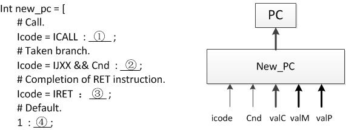
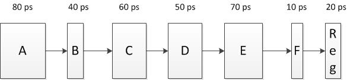

# 2013期末-带答案

> 来源：`往年题/期末/2013期末-带答案.pdf`　共 22 页

<!-- ===== page 1 ===== -->

北京大学信息科学技术学院考试试卷
考试科目： 计算机系统导论  姓名：          学号：
考试时间： 2014 年 1  月 7  日 任课教师:
题号  一  二  三  四  五  六  七  八  总分
分数
装
阅卷人
订
线
  北京大学考场纪律
内
     1、考生进入考场后，按照监考老师安排隔位就座，将学生证放在桌面上。
    无 学生证者不能参加考试；迟到超过15分钟不得入场。在考试开始30分钟后
    方 可交卷出场。
      2、除必要的文具和主考教师允许的工具书、参考书、计算器以外，其它
    所 有物品（包括空白纸张、手机、或有存储、编程、查询功能的电子用品等）
    不 得带入座位，已经带入考场的必须放在监考人员指定的位置。
   3、考试使用的试题、答卷、草稿纸由监考人员统一发放，考试结束时收
   以下以下为答题纸，共    页
回，一律不准带出考场。若有试题印制问题请向监考教师提出，不得向其他考
不
生询问。提前答完试卷，应举手示意请监考人员收卷后方可离开；交卷后不得
在 考场内逗留或在附近高声交谈。未交卷擅自离开考场，不得重新进入考场答
要
卷 。考试结束时间到，考生立即停止答卷，在座位上等待监考人员收卷清点后，
答
方 可离场。
题   4、考生要严格遵守考场规则，在规定时间内独立完成答卷。不准交头接
  耳，不准偷看 、夹带、抄袭或者有意让他人抄袭答题内容，不准接传答案或者
试卷等。凡有违纪作弊者，一经发现，当场取消其考试资格，并根据《北京大
学本科考试工 作与学术规范条例》及相关规定严肃处理。
5、考生须 确认自己填写的个人信息真实、准确，并承担信息填写错误带
来的一切责任 与后果。
学校倡议所有考生以北京大学学生的荣誉与诚信答卷，共同维护北京大
学的学术声誉 。
以下为试题和答题纸，共   页。
1

<!-- ===== page 2 ===== -->

得分
第一题 单项选择题（每小题1.5分，共30分）
1、对于IEEE浮点数，如果减少1位指数位，将其用于小数部分，将会有怎样的
效果？答：（     ）
A. 能表示更多数量的实数值，但实数值取值范围比原来小了。
B. 能表示的实数数量没有变化，但数值的精度更高了。
C. 能表示的最大实数变小，最小的实数变大，但数值的精度更高。
D. 以上说法都不正确。
答案：C
因为NaN更多，所以能表示的实数值更少。
指数小了，所以最大实数变小，最小实数变大。
小数部分增加了，所以精度更高。
2、按照教材描述的原则，对于 x86_64 程序，在 callq 指令执行后，函数的第
一个参数一般存放在哪里？答：（     ）
A. 8(%rsp)    B. 4(%rsp)    C. %rax    D. %rdi
答案：D
考察学生对x86_64与IA-32在函数参数传递上的不同。
3、已知变量x的值已经存放在寄存器eax中，现在想把5x+7的值计算出来并存
放到寄存器ebx中，如果不允许用乘法和除法指令，则至少需要多少条IA-32指
令完成该任务？答：（     ）
A. 1条     B. 3条     C. 2条     D. 4条
答案：A
考察学生对leal指令的用法是否熟悉。
使用一条指令“leal 7(%eax, %eax, 4), %ebx”即可。
4、 在Y86的SEQ实现中，PC（Program Counter，程序计数器）更新的逻辑
结构如下图所示，请根据HCL描述为①②③④选择正确的数据来源。
2

<!-- ===== page 3 ===== -->

其中：Icode为指令类型，Cnd为条件是否成立，valC表示指令中的常数值，valM
表示来自返回栈的数据，valP表示PC自增。
①    A ：A）valC  B）valM   C）valP
②    A ：A）valC  B）valM   C）valP
③    B ：A）valC  B）valM   C）valP
④    C ：A）valC  B）valM   C）valP
（5~6） 如果直接映射高速缓存（Cache）的大小是4KB，并且块大小（block）
大小为32字节。
5、请问它每路（way）有多少行（line）？ 答：（      ）
A. 128        B. 64         C. 32           D. 1
答案：选 A，容量=路容量*路数=cache 行大小*Set 数*路数->set 数
=4KB/32B=27=128
6、如果数据访问的地址序列为 0->4->16->132->232->4096->160（以字节
为单位），请问一共发生多少次替换？答：（     ）
A. 0          B. 1          C. 2            D. 3
答案：选B，连续访问set数相同的数据会发生替换，set号有地址5~11位
决定，等于地址A mod(128*32)，只有0与4096位于同一cache行
7、下列程序运行的结果是什么？答：（       ）
/* main.c */
int i=0;
int main()
{
  foo();
  return 0;
}
3

<!-- ===== page 4 ===== -->

/* foo.c */
int i=1;
void foo()
{
  printf(“%d”, i);
}
A. 编译错误                B. 链接错误
C. 段错误                  D. 有时打印输出1，有时打印输出0；
答案：B考点：链接的基本概念，符号解析的原则；
注：由于印刷版中引号的问题（现已修正），本题选A也算对
8、在链接时，对于什么样的符号一定不需要进行重定位？答：（      ）
A．不同C语言源文件中定义的函数
B．同一C语言源文件中定义的全局变量
C．同一函数中定义时不带static的变量
D．同一函数中定义时带有static的变量
答案：C
说明：考察需要进行重定位的条件。A 在链接前不在同一目标文件中，BD 都位
于.data段中，这些都需要重定位。C位于栈中或者寄存器中，不需要重定位。
9、关于信号的描述，以下不正确的是哪一个？答：（        ）
A. 在任何时刻，一种类型至多只会有一个待处理信号
B. 信号既可以发送给一个进程，也可以发送给一个进程组
C. SIGTERM和SIGKILL信号既不能被捕获，也不能被忽略
D. 当进程在前台运行时，键入Ctrl-C，内核就会发送一个SIGINT信号给
这个前台进程
答案：C
说明：考察信号的基本了解，C应该为“SIGKILL和SIGSTOP信号既不能被捕获，
也不能被忽略”
10、下面关于非局部跳转的描述，正确的是（        ）
A. setjmp可以和siglongjmp使用同一个jmp_buf变量
B. setjmp必须放在main()函数中调用
C. 虽然longjmp通常不会出错，但仍然需要对其返回值进行出错判断
4

<!-- ===== page 5 ===== -->

D. 在同一个函数中既可以出现setjmp，也可以出现longjmp
答案：D
说明：考察非局部跳转的基本了解；D选项：可以采用不同的jmp_buf
11、假设有一台64位的计算机的物理页块大小是8KB，采用三级页表进行虚拟地
址寻址，它的虚拟地址的 VPO（Virtual Page Offset，虚拟页偏移）有 13
位，问它的虚拟地址的VPN（Virtual Page Number，虚拟页号码）有多少位？
答：（     ）
A. 20       B. 27       C. 30         D. 33
答案：选C。
本题考查对页表组成的理解。
页块大小为8KB，即2^13 byte。在64位机器上，一个页表条目为8byte。故
共有页表条目2^10项，故每一级页表可以表示10位地址。因此三级页表存储，
共需要10*3=30位。
12、进程P1通过fork()函数产生一个子进程P2。假设执行fork()函数之前，
进程P1占用了53个（用户态的）物理页，则fork函数之后，进程P1和进程
P2共占用_______个（用户态的）物理页；假设执行fork()函数之前进程P1
中有一个可读写的物理页，则执行fork()函数之后，进程P1对该物理页的页表
项权限为________。上述两个空格对应内容应该是（      ）
A. 53，读写   B. 53，只读   C. 106，读写   D. 106，只读
答案：选B。
fork使用之后，只生成新的mm_struct等结构，不会将原来的数据也拷贝一份，
而是采用了copy-on-write的策略，因而占用的物理内存不会是原来的两倍，
同时这两个进程的页表项权限都只有读。
13、下列哪个例子是外部碎片？答：（      ）
A. 分配块时为了字节对齐而多分配的空间
B. 空闲块中互相指向的指针所占据的空间
C. 多次释放后形成的不连续空闲块
D. 用户分配后却从未释放的堆空间
答案：C
5

<!-- ===== page 6 ===== -->

14、用带有header和footer的隐式空闲链表实现分配器时，如果一个应用请
求一个3字节的块，下列说法哪一项是错误的？答：（     ）
A. 搜索空闲链表时，存储利用率为：best fit > next fit > first fit
B. 搜索空闲链表时，吞吐率为：next fit > first fit > best fit
C. 在x86机器上，malloc(3)实际分配的空闲块大小可能为8字节
D. 在x64机器上，malloc(3)返回的地址可能为2147549777
答案 ：D，malloc在64位机器上返回的地址应该按16字节对齐。
15、考虑如下代码，假设result.txt的初始内容是“123”。
int main(int argc, char** argv)
{
int fd1 = open("result.txt", O_RDWR);
char str[] = "abc";
char c;
write(fd1, str, 1);
read(fd1, &c, 1);
write(fd1, &c, 1);
return 0;
}
在这段代码执行完毕之后，result.txt 的内容是什么？（假设所有的系
统调用都会成功）答：（      ）
A．a22     B．a21     C．a13     D．abb
答案：A。考察文件操作过程中指针的移动情况。
16、已知如下代码段
write(fd1, str1, strlen(str1));
write(fd2, str2, strlen(str2));
可以在原本为空的文件ICS.txt中写下字符串 I love ICS!
对于下面这些对于变量fd1, fd2, str1, str2的定义：
(1)
int fd1 = open("ICS.txt", O_RDWR);
int fd2 = open("ICS.txt", O_RDWR);
char *str1 = "I love ";
char *str2 = "ICS!";
(2)
int fd1 = open("ICS.txt", O_RDWR);
int fd2 = dup(fd1);
6

<!-- ===== page 7 ===== -->

char *str1 = "I love ";
char *str2 = "ICS!";
(3)
int fd1 = open("ICS.txt", O_RDWR);
int fd2 = open("ICS.txt", O_RDWR);
char *str1 = "I love ";
char *str2 = "I love ICS!";
(4)
int fd1 = open("ICS.txt", O_RDWR);
int fd2 = dup(fd1);
char *str1 = "I love ";
char *str2 = "I love ICS!";
下面哪一个组合是正确的：（       ）
A．(1)(4)       B．(2)(3)       C．(1)(2)(3)(4)    D．都不正确
答案：B
说明：考察两种不同文件描述符指向同一文件v的不同，一种是指向了同一的open
file table，一种是指向了同一的v-node table。
17、下列关于计算机网络概念的说法中，哪一项是正确的？答：（     ）
A. 全球最大的计算机网络是互联网 Internet，所以计算机网络协议是
Internet Protocol即IP协议。
B. 计算机之间的网络通信是一个机器上的一个 process (如 client
process) 与另一个机器上的 process (如 server process) 之间
的通信。
C. 网络应用程序有默认的端口号，大部分应用的端口号可以修改，而少部分
知名应用如Web服务程序的端口号80是无法修改的。
D. 一个域名只能对应一个IP地址；而一个IP地址可以对应多个域名。
答案：B
解释：考察第一部分
A. IP只是计算机网络众多协议中的一种；IP是具有代表性的一种协议；但还有
其他很多协议。
C. 端口号是可以修改的，默认端口号只是为了方便
D. 一个域名可以对应多个IP；一个IP也可以对应多个域名。
18、在 client-server 模型中，一个连接（connection）可以由 IP 地址，
7

<!-- ===== page 8 ===== -->

端口号的组合来表示。假设一个访问网页服务器的应用，客户端 IP 地址为
128.2.194.242，目标服务器端 IP 地址为 208.216.181.15，用户设置的代
理服务器 IP 地址为 155.232.108.39。目标服务器同时提供网页服务（默认端
口80），和邮件服务（默认端口25）。当客户端向目标服务器发送访问网页的请求
时，下面connection socket pairs 正确的一组是？答：（       ）
  客户端请求  代理请求
(128.2.194.242:25,  (128.2.194.242:51213,
A  155.232.108.39:80)  208.216.181.15:80)
(128.2.194.242:51213,  (128.2.194.242:12306,
B  155.232.108.39:80)  208.216.181.15:80)
(128.2.194.242:25,  (155.232.108.39:51213,
C  208.216.181.15:80)  208.216.181.15:80)
D  (128.2.194.242:51213,  (155.232.108.39:12306,
208.216.181.15:80)  208.216.181.15:80)
答案：D
解释：考察所有三部分内容
（客户端请求）这一段，客户端发送的请求，源地址是客户自己地址
128.2.194.242，端口号是临时端口号；目标地址仍是服务器地址
208.216.181.15:80默认端口80
（代理请求）这一段，代理发送的请求，源地址是代理自己地址155.232.108.39，
端口号是临时端口号；目标地址仍是服务器地址208.216.181.15:80默认端口
80。
所以，选项D正确。
（选项A/B中，目标地址不是代理的地址，而是目标服务器的地址。）
（选项C中，端口号25属于电子邮件应用默认端口号，不作为客户端的临时端口
号。）
19、在Pthread线程包使用中，下列代码输出正确的是：（     ）
void *th_f(void * arg)
{
 printf("Hello World") ;
  pthread_exit(0) ;
}
int main(void)
{
8

<!-- ===== page 9 ===== -->

   pthread_t tid;
   int st;
   st = pthread_create(&tid,NULL,th_f,NULL);
   if(st<0) {
      printf("Oops, I can not create thread\n");
      exit(-1);
   }
   sleep(1);
   exit(0);
}
A. Oops, I can not create thread
B. Hello World
  Oops, I can not create thread
C. Hello World
D. 不输出任何信息
答案：C
20、有四个信号量，初值分别为：a=1,  b=1,  c=1,  d=1
线程1：  线程2：  线程3：
① P(a);   ⑨ P(c);  ⑮ P(d);
② P(b);  ⑩ P(b);  ⑯ P(a);
③ P(d);   ⑪ V(c);  ⑰ V(d);
④ P(c);  ⑫ V(b);  ⑱ P(b);
⑤ V(d);  ⑬ P(a);  ⑲ V(a);
⑥ V(a);  ⑭ V(a);  ⑳ V(b);
⑦ V(b);
⑧ V(c);
上面的程序执行时，下列哪些执行轨迹不会产生死锁?
A. ①②③⑨⑩⑮④      B. ⑨①②③⑩
C. ①②⑮⑨③          D. ⑨①⑮②③
答案：实际上四个选项都有问题，无正确答案，因此批卷时本题直接算作得分
9

<!-- ===== page 10 ===== -->

  得分
 第二题（8分）
考虑一种新的遵从IEEE规范的浮点的格式，包含3位指数位，4位小数位和
1位符号位。请填写下面的表格。
描述  十进制数(或分数)  二进制表示
Bias  3  --------
最小的正数  1/64  0 000 0001
最小的有限数  -15.5  1 110 1111
最小规格正数  1/4  0 001 0000
---  -11/32  1 001 0110
---  7/2  0 100 1100
---  63/128  0 010 0000
---  13.25  0 110 1010
 每行1分
考察学生对浮点数的掌握程度，包括舍入。
10

<!-- ===== page 11 ===== -->

得分
第三题 （12分）
如图所示，每个模块表示一个单独的组合逻辑单元，每个单元的延迟已在图中标出。
通过在两个单元间添加寄存器的方式，可以对该数据通路进行流水化改造。假设每
个寄存器的延迟为20ps。
1）如果改造为一个二级流水线（只插入一个寄存器），为获得最大的吞吐率，该寄
存器应在哪里插入？请计算该流水线的吞吐率，并说明计算过程。
插入在CD间（1分）
1000/(80+40+60+20) = 1000/200= 5GIPS（过程1分，结果1分）
2）如果改造为一个三级流水线（插入两个寄存器），为获得最大的吞吐率，寄存器
应在哪里插入？请计算该流水线的吞吐率，并说明计算过程。
插入在BC间和DE间（1分）
1000/(80+40+20) = 1000/140 = 7.143 GIPS（过程1分，结果1分）
3）如果改造为一个四级流水线（插入三个寄存器），为获得最大的吞吐率，寄存器
应在哪里插入？请计算该流水线的吞吐率，并说明计算过程。
插入AB间、CD间、DE间（1分）
1000/(100+20) = 1000/120 = 8.33 GIPS（过程1分，结果1分）
4）不改变单元划分，为获得最大性能，该设计至少需要划分成几级？请计算对应
的吞吐率，并说明计算过程。
至少划分成5级（1分）
1000/(80+20) = 10 GIPS（过程1分，结果1分）
11

<!-- ===== page 12 ===== -->

  得分
 第四题（10分）
 考 虑如下两个程序（fact1.c和fact2.c）：
 /* fact1.c */
#idnetf itnaeb lMeA[XMNAUXMN U1M2] ;
iinntt  fmaacitn((iinntt  na)r;g c , char **argv) {
        ittnaatbb llnee;[[ 01]]  ==  01;;
i f (parrignct f=(=" E1r)r o{r :  missing argument\n");
 }  exit (0);
argv++;
i{ f (sscanf(*argv, "%d", &n) != 1 || n < 0 || n >= MAXNUM)
 *   a  r  gpevrx)ii;nt t f( 0()"; Error: %s not an int or out of range\n",
}p rintf("fact(%d) = %d\n", n, fact(n));
}
 /i*n tf*a ctta2b.lce ; */
i  n t  sftaactti(ci nitn tn )n u{m  = 2;
         i f   (inn t> =i  n=u mn)u m{;
                 w h i ltea b(lie [<i=]  n=)  t{a ble[i-1] * i;
            i++;
12

<!-- ===== page 13 ===== -->

        }
        num = i;
    }
    return table[n];
}
（1）对于每个程序中的相应符号，给出它的属性（局部变量、强全局变量或弱全
局变量），以及它在链接后位于ELF文件中的什么位置？（提示：如果某表项中的
内容无法确定，请画X）（6分）
fact1.c
变量  类型  ELF Section
table  weak global  .bss
fact  weak global  X（或.bss）
num  X  X
fact2.c
变量  类型  ELF Section
table  weak global  .bss
fact  strong global  .text
num  local  .data
（2）对上述两个文件进行链接之后，会对每个符号进行解析。请给出链接后下列
符号被定义的模块（fact1 or fact2）。（2分）
  定义模块
table  不确定
fact  fact2
num  fact2
（3）使用gcc（命令：gcc -o fact fact1.c fact2.c）来编译之后得到的
可执行文件是否能够正确执行？为什么？（2分）
不一定能正确执行。因为 table 在两个文件中都是 weak global，因此链
接器会任选一个定义来解析 table。而因为在 fact2 模块中只给 table 预留了
一个单字（4 字节）空间，因此如果选择了 fact2 来解析 table 的话，会出现
segmentation fault。【该问题已经过编译检查确认。】
考察知识点：linking的基本概念、符号属性、链接的过程、符号的解析等。
13

<!-- ===== page 14 ===== -->

  得分
 第五题（10分）
P请a阅rt读 以I 下程序，然后回答问题（假设程序中的函数调用都可以正确执行）：
int main() {
   pirfi (nftofr(k"(A\)n "=)=;  0) {
    }  printf("B\n");
   e lsep r{i ntf("C\n");
    A
   }p rintf(“D\n");
 }  exit(0);
（1） 如果程序中的A位置的代码为空，列出所有可能的输出结果：（1分）
 4个：分别是ABDCD ABCDD ACBDD ACDBD（错一个扣半分，多了也扣半分，最
多扣1分）
 （2）如果程序中的A位置的代码为：
列出所wa有it可p能id的(-输1出, 结NU果L：L（, 20分);）
 3个：分别是ABDCD ABCDD ACBDD（每个半分，多了扣一分，最多扣2分）
 （3）如果程序中的A位置的代码为：
列出所pr有in可t能f(的“E输\出n”结);果 ：（2分）
7个： 分别是ABDCED ABCEDD ACEBDD ACEDBD ACBEDD ACBDED ABCDED（错
一  个扣半分，多了扣一分）
14

<!-- ===== page 15 ===== -->

Part II
请阅读以下程序，然后回答问题（假设程序中的函数调用都可以正确执行，且
每条语句都是原子动作）：
pid_t pid;  1). 完成程序，使得程序在输出前20个
int even = 0;  斐波那契(Fibonacci)数列，即 F0=0,
int counter1 = 0;  F1=1, …, Fn=Fn-1+Fn-2。（如果存在对本
ivnoti dc ohuanntdelre2r 1=( i1n;t  sig) {  次程序执行结果没有影响的语句，请在相
  if (even % 2 == 0) {  应位置填写“无关”）（3分）
  printf(“%d\n”,
counter1);    A: ___counter1 + counter2__
    counter1 =      A       ;
    } else {    B: ___counter1 + counter2__
  printf(“%d\n”,
counter2);    C: ___even + 1____________
    counter2 =      B      ;
    }    D: ____无关__________
    even =      C      ;
}    E: ___SIGUSR1___________
void handler2(int sig) {
    if (_____D_____) {    F: ___SIGUSR1___________
    counter1 = even * even;
    } else {  2). 完成程序，其中A, B处保持不变，
    counter2 = even * even;  使得程序可以分别输出前几个奇数或偶
    }  数的平方和。（如果存在对本次程序执行
}  结果没有影响的语句，请在相应位置填写
int smiaginna(l)( S{I GUSR1, handler1);  “无关”）（2分）
signal(SIGUSR2, handler2);  其中：
if ((pid = fork()) == 0) {    若要输出奇数的平方和：even的初
while (1) {};  始值为3；
    }    若要输出偶数的平方和，even的初
    while (even < 20) {  始值为2。
      kill(pid,     E   );
      sleep(1);    C: ____even + 2__________
      kill(pid,     F   );
      sleep(1);    D: ____even % 2 == 1______
      even += 2;
    }    E: ____SIGUSR2__________
kill(pid, SIGKILL);
exit(0);    F: ____SIGUSR1__________
}
15

<!-- ===== page 16 ===== -->

得分
第六题（10分）
Intel 的 IA32 体系结构采用二级页表，称第一级页表为页目录(Page
Directory)，第二级页表为页表(Page Table)。其虚拟地址到物理地址的翻
译方式如下图。先根据CR3找到页目录地址，然后依据偏移Dir找到一个页目录
项，页目录项的高 20 位(PPN)为二级页表地址；在二级页表中根据偏移 Table
找到页表项，页表项中的高20位(PPN)即为物理地址的高20位，将这20位与虚
拟地址的低12位拼在一起形成完整的物理地址。
页目录和页表均有1024项，每一项为4字节，含义如下：
16

<!-- ===== page 17 ===== -->

页目录和页表由操作系统维护，通常情况下只能在内核态下访问，为了给用户
提供一个访问页表项和页目录项内容的接口，假设操作系统中已经执行过如下代码
段：
#define UVPT 0xef400000
#define PDX(la)  ((((unsigned int) (la)) >> 22) & 0x3FF)
……
kern_pgdir[PDX(UVPT)] = PADDR(kern_pgdir) | PTE_U | PTE_P;
其中kern_pgdir是操统系统维护的页目录数组，共1024项，每一项的类
型为unsigned int。PADDR(kern_pgdir)用于获得kern_pgdir的物理地址，页目
录在物理内存中正好占一页，所以kern_pgdir的物理地址是4KB对齐的。PTE_U
和PTE_P代表了这个页目录项的权限，即用户态可访问(只读)。可以看到，这条
语句将页目录的第PDX(UVPT)项指向了页目录自身。
利用这一点，对于给定的虚拟地址 va，可以获得 va 对应的页目录项和页表
项内容，分别对应于函数get_pde和get_pte，请完成这两个函数（每空2分）：
#define UVPT 0xef400000
// get_pde(va)：获取虚拟地址va对应的一级页表(页目录)中的页目录项内容
unsigned int get_pde(unsigned int va) {
    unsigned int pdx = (va >> _[1]___  ____ ) & _[2]_        _;
    unsigned int addr = UVPT + (_[3]_         ___) + pdx * 4;
return *((unsigned int *)(addr));
}
// get_pte(va)：获取虚拟地址va对应的二级页表中的页表项内容
unsigned int get_pte(unsigned int va) {
    unsigned int PGNUM = va >> ___[4]_              __;
    unsigned int addr = ___[5]_            _ + PGNUM;
    return *((unsigned int *)(addr));
}
l  答案：
[1]: 22         [2]  0x3ff  (或1023)  [3]   UVPT >> 10
[4]: 10         [5]   UVPT
17

<!-- ===== page 18 ===== -->

#define UVPT 0xef400000
unsigned int get_pde(unsigned int va) {
    unsigned int pdx = (va >> 22) & 0x3ff;
    unsigned int addr = UVPT + (UVPT >> 10) + pdx * 4;
    return *((unsigned int *)(addr));
}
unsigned int get_pte(unsigned int va) {
    unsigned int PGNUM = va >> 12;
    unsigned int addr = UVPT + PGNUM * 4;
    return *((unsigned int *)(addr));
}
要获取页目录项，需要让addr= UVPT[31:22] | UVPT[31:22] | PDX |
00，即最高的10位为UVPT的高10位，中间的10位也是UVPT的高10位，接
下来10位是PDX(va的高10位)，最后两位为0。
这样，根据翻译机制，第一步取出addr的高10位UVPT[31:22]，由于页
目录中UVPT[31:22]指向的是页目录本身，所以这一步找到的二级页表仍然为页
目录本身。第二步取出中间10位UVPT[31:22]，重复刚才的过程，这一步找到
的物理页仍然为页目录本身。最后加上偏移量 PDX|00 就可以找到页目录中的第
PDX项。
要获取页表项，让addr= UVPT[31:22] | PDX | PTX | 00，其中PTX
是va的中间10位。这样，第一步翻译后得到的二级页表仍然指向页目录本身，
第二步翻译后得到的物理页指向的是va对应的二级页表。最后用偏移量PTX|00
即可获得二级页表中的第PTX项。
18

<!-- ===== page 19 ===== -->

得分
第七题（10分）
（1） 一个服务器拥有两个独立的固定IP地址，那么它在web应用端口80上最
多可以监听多少个独立的 socket 连接？（2分）
答案：2*248
服务器端  客户端  结果
2个独立固定IP  任意32位IP  2*232+16
任 意 16 位   port
number
（2） 该服务器在所有有web应用端口上最多可以监听多少个独立的 socket 连
接？（2分）
答案：2*264
服务器端  客户端  结果
2个独立固定IP  任意32位IP  2*216+32+16
任意16位port number  任 意 16 位   port
number
（3） 在下图中连线上填入正确的目标服务器的socket 标识符（2分）
19

<!-- ===== page 20 ===== -->

答案：
128.2.194.242:80
128.2.194.242:7
4) 在Echo server 范例中，server端通过accept函数接受了一个 client
的连接请求，从而将网络描述符与该网络连接、socket绑定，然后进行网络数据
传输。在下面的空格处填写正确的网络描述符，每个空填写listenfd 或connfd
（共4分，每空1分）。
int main(int argc, char **argv) {
int listenfd, connfd, port, clientlen;
struct sockaddr_in clientaddr;
struct hostent *hp;
char *haddrp;
unsigned short client_port;
…………
while (1) {
clientlen = sizeof(clientaddr);
_________ = Accept(_________, (SA *)&clientaddr,
&clientlen);
hp = Gethostbyaddr((const char*)
&clientaddr.sin_addr.s_addr,
sizeof(clientaddr.sin_addr.s_addr), AF_INET);
haddrp = inet_ntoa(clientaddr.sin_addr);
client_port = ntohs(clientaddr.sin_port);
printf("server connected to %s (%s), port %u\n",
hp->h_name, haddrp, client_port);
echo(_________);
Close(_________);
    }
}
答案：connfd, listenfd, connfd, connfd
accept 之后把参数里的listenfd 转交给 connfd
server 无法支持多个 connections，因为只有一个文件描述符（listenfd）
考察学生对 网络文件描述符、listenfd、connfd的理解。
20

<!-- ===== page 21 ===== -->

得分
第八题（10分）
某个城市为了解决市中心交通拥堵的问题，决定出台一项交通管制措施，对进
入市中心区的机动车辆实行单双日限制行驶的办法。具体要求是，逢单日，只允许
车辆牌号号码为单数的机动车进入市中心区；同样，逢双日，只允许车辆牌号号码
为双数的机动车进入市内中心区。有一个进入市中心区的交通路口，进入该路口的
道路有一条，离开该路口的道路有两条，其中一条是通往市中心区的道路，而另一
条是绕过市中心区的环路，在进入路口处设置了自动识别车辆牌号的识别设备与放
行栅栏控制设备。在单日，遇到单号车辆进入路口车辆号码识别区，号码识别设备
打开通往市中心区道路的放行栅栏；而遇到双号车辆，则打开绕过市中心区环路的
放行栅栏。反之亦然。显然，只有在该路口车辆号码识别区中无车时，才允许一辆
车进入车辆号码识别区。同时为了防止有车辆混过路口，两个放行栅栏平时处于关
闭状态，只有在车辆号码识别区中的车辆已被识别出单双号之后，放行栅栏才会在
识别设备的控制下，打开对应的放行栅栏，在车辆通过之后，该放行栅栏自行关闭。
vehicle_n  int；         /* 车辆号码 */
检查车辆牌号线程T1：
  while (1) {
车辆到达识别区路口；
①
车辆进入号码识别区；
if  (vehicle_n == 奇数)
{    ②        }
   else
{    ③        }
 }；
市区放行栅栏线程T2：
  while (1) {
④
允许车辆进入市中心区；
⑤
 }；
21

<!-- ===== page 22 ===== -->

环路放行栅栏线程T3：
  while (1) {
⑥
允许车辆绕行环路；
⑦
}；
1）请设计若干信号量，给出每一个信号量的作用和初值。（3分）
参考答案：
Check：指示可否在车辆号码识别区中进入一辆汽车，由于只能进入一辆，其
初值为1。
Odd：指示汽车号码是否为奇数，其初值为0，表示不是奇数。
Even：指示汽车号码是否为偶数，其初值为0，表示不是偶数。
2）请将信号量上对应的PV操作填写在代码中适当位置。（7分）
  参考答案：
① P(Check)；
② V(Odd)；
③ V(Even)；
④ P(Odd)；
⑤ V(Check)；
⑥ P(Even)；
⑦ V(Check)；
22
