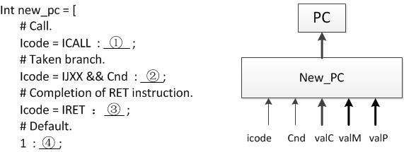

# 2015期末-20151109-带答案

> 来源：`往年题/期末/2015期末-20151109-带答案.pdf`　共 20 页

<!-- ===== page 1 ===== -->

北京大学信息科学技术学院考试试卷
考试科目：计算机系统导论 姓名：          学号：
考试时间： 2015 年 11 月 09 日 小班教师:
题号  一  二  三  四  五  总分
分数
装
阅卷人
订
线
北京大学考场纪律
内
     1、考生进入考场后，按照监考老师安排隔位就座，将学生证放在桌面上。
    无 学生证者不能参加考试；迟到超过15分钟不得入场。在考试开始30分钟后
    方可交卷出场。
     2、除必要的文具和主考教师允许的工具书、参考书、计算器以外，其它
    所 有物品（包括空白纸张、手机、或有存储、编程、查询功能的电子用品等）
   不 得带入座位，已经带入考场的必须放在监考人员指定的位置。
    3、考试使用的试题、答卷、草稿纸由监考人员统一发放，考试结束时收
   回，一律不准带出考场。以若下有试以题下印为制答问题题纸请，向监共考  教  师页提 出，不得向其他考
生询问。提前答完试卷，应举手示意请监考人员收卷后方可离开；交卷后不得
不
在考场内逗留或在附近高声交谈。未交卷擅自离开考场，不得重新进入考场答
要 卷。考试结束时间到，考生立即停止答卷，在座位上等待监考人员收卷清点后，
方 可离场。
答
4、考生要严格遵守考场规则，在规定时间内独立完成答卷。不准交头接
题 耳 ，不准偷看、夹带、抄袭或者有意让他人抄袭答题内容，不准接传答案或者
  试卷等。凡有 违纪作弊者，一经发现，当场取消其考试资格，并根据《北京大
学本科考试工作与学术规范条例》及相关规定严肃处理。
5、考生须 确认自己填写的个人信息真实、准确，并承担信息填写错误带
来的一切责任与后果。
学校倡议 所有考生以北京大学学生的荣誉与诚信答卷，共同维护北京大
学的学术声誉 。
以下为试题和答题纸，共    页。
1

<!-- ===== page 2 ===== -->

得分
第一题 单项选择题（每小题1分，共20分）
注：请将选择题答案填写在下表中
题号  1  2  3  4  5  6  7  8  9  10
答案
题号  11  12  13  14  15  16  17  18  19  20
答案
1.  给定一个实数，会因为该实数表示成单精度浮点数而发生误差。不考虑 NaN
和Inf的情况，该绝对误差的最大值为
A.  2103
B.  2104
C.  2230
D.  2231
参考信息：单精度浮点数阶码8位，尾数23位
答案：a。计算过程：浮点数阶码8位，即最大指数为127，尾数为23位，即最
低位表示的数为2−23∗2127=2104。那么误差在刚好落在最低位的一半的时候最大，
即2103。其他选项为干扰项，如果求最大指数的时候忘记非规格化数或者对偶数舍
入理解不深会算出b，如果以为指数为非规格化数会算出c或d。
2.  以下说法错误的是
A.  负数加上负数结果可能为正数
B.  正数加上正数结果可能为负数
C.  用&和~可以表示所有的逻辑与或非操作
D.  用&和|可以表示所有的逻辑与或非操作
答案：d。无法用&和|表示逻辑非
3.  在32位平台上，按C90标准以下语句中，结果为假的是
A.  return INT_MIN < INT_MAX;
B.  return -2147483648 < 2147483647;
C.  int a = -2147483648; return a < 2147483647;
D.  return -2147483647-1 < 2147483647;
参考信息：
2

<!-- ===== page 3 ===== -->

C90的转换顺序：int -> long -> unsigned -> unsigned long
231=2147483648
答案：b。因为2147483648超出了有符号数的表示范围，C90的C语言会将其
识别为unsigned。注意在32位机器上long和int都是32位。
4.  关于浮点数，以下说法正确的是
A.  给定任意浮点数a，b和x，如果a>b成立（求值为1），则一定a+x>b+x
成立
B.  不考虑结果为NaN、Inf或运算过程发生溢出的情况，高精度浮点数一定
得到比低精度浮点数更精确或相同的结果
C.  不考虑输入为NaN、Inf的情况，高精度浮点数一定得到比低精度浮点数
更精确或相同的结果
D.  给定任意浮点数a, b和x，如果a>b不成立（求值为0），则一定a+x>b+x
不成立。
答案：d。如果不出现NaN和Inf，浮点数是满足单调性的，这时a和d都成立。
如果出现NaN和Inf，那么任何时候比较运算的操作数有NaN和Inf就为0，就
只有d成立。关于b和c，由于运算的偶然性，高精度不一定比低精度精确。
5.  已知下面的数据结构，假设在Linux/IA32下要求对齐，这个结构的总的大
小是多少个字节？如果重新排列其中的字段，最少可以达到多少个字节？
struct {
char a;
double *b;
double c;
short d;
long long e;
short f;
};
A. 32, 28
B. 36, 32
C. 28, 26    D. 26, 26
选择A, Linux/IA32要求double和long long在4字节边界上对齐，
其中a占1字节，后面填充1字节，b占4字节，填充2个字节，c占8字节，
d占2字节，填充2字节，e占8字节，f占2字节，再填充2字节，共32字
节；重新排列时，可以按字节数从大到小排列，最后，最少需要8+8+4+2+2+1
再加3字节满足4字节对齐要求，共28个字节。
3

<!-- ===== page 4 ===== -->

6. A.下 (列%寻ea址x,模 式, 中4)， 正确的是：
BC..  (1%2e3 ax, %esp, 3)
D. $1(%ebx, %ebp, 1)
  选择C. A中不能省略Ei，B中比例因子错误，D中偏移地址表示错误。
7.  假设存储器按“大端法”存储数据对象，已知如下的C语言数据结构：union
A.{  0cxh0a1r2 3c [2]; int i; }; 当c的值为0x01, 0x23时，i的值为：
BC..  00xx203102130 000
D.不确定
  选择D. 因为i的两个高地址字节的值未知。
8.  假设mo某v条l C8(语%言ebspw)i,t c%hea语x 句编译后产生了如下.的L7汇: 编代码及跳转表：
scumbpll  $$488,,  %%eeaaxx   ..lloonngg  ..LL32
jjam p. L*2. L7(, %eax, 4)  ..lloonngg  ..LL25
  .long .L4
...lllooonnnggg   ...LLL562
.long .L3
在A.源 ‘程2’序,中 ‘，7下’ 面的哪些（个）标号出现过：
BC..  1‘ 3’
D. 5
选  择C. 标号的取值范围为’0’ – ，’1’、’2’、’7’、’9’、…等没有出现。
9.  x86体系结构中，下面哪个说法是正确的？
A. leal指令只能够用来计算内存地址
B. x86_64机器可以使用栈来给函数传递参数
4

<!-- ===== page 5 ===== -->

C. 在一个函数内，改变任一寄存器的值之前必须先将其原始数据保存在栈内
D. 判断两个寄存器中值大小关系，只需要SF和ZF两个条件码
答案：B
A.leal指令做普通算术运算；C.caller saved寄存器才需要；D.还需要OF
10. 下列的指令组中，哪一组指令只改变条件码，而不改变寄存器的值？
A. CMP, SUB
B. TEST, AND
C. CMP, TEST
D. LEAL, CMP
答案：C
SUB和AND都同时会改变条件码和寄存器的值，LEAL不改变改变条码。
11. 下面有关指令系统设计的描述正确的是：
A. 采用CISC指令比RISC指令代码更长。
B. 采用CISC指令比RISC指令运行时间更短
C. 采用CISC指令比RISC指令译码电路更加复杂
D. 采用CISC指令比RISC指令的流水线吞吐更高
答案：C ，CISC 的比 RISC 代码复杂（如不定长），因此译码也更复杂，优点是
代码更短。运行时间和吞吐都谁更高要依据实际应用。
12. 一个功能模块包含组合逻辑和寄存器，组合逻辑单元的总延迟是 100ps，单
个寄存器的延时是20ps，该功能模块执行一次并保存执行结果，理论上能达
到的最短延时和最大吞吐分别是多少？
A. 20ns, 50GIPS
B. 120ns，50GIPS
C. 120ns，10GIPS
D. 20ps,10GIPS
答案：B，主要考察延时和吞吐的区别，延时最小是 logic + 1 个 register，
吞吐最高时是把 logic 划分成无穷多份， 每一级需要 20ps, 1000/20ps =
50GIPS
13. 关于流水线技术的描述，错误的是：
A. 流水线技术能够提高执行指令的吞吐率，但也同时增加单条指令的执行时
间。
B. 减少流水线的级数，能够减少数据冒险发生的几率。
C. 指令间数据相关引发的数据冒险，都可以通过data forwarding来解决。
5

<!-- ===== page 6 ===== -->

D. 现代处理器支持一个时钟内取指、执行多条指令，会增加控制冒险的开销。
答：C，load-use冒险 不能通过data forwarding来解决
14. 在Y86的SEQ实现中，PC（Program Counter，程序计数器）更新的逻辑
结构如下图所示，请根据HCL描述为①②③④选择正确的数据来源。
其中：Icode为指令类型，Cnd为条件是否成立，valC表示指令中的常数值，
valM表示来自返回栈的数据，valP表示PC自增。
A. valC, valM, valP, valP
B. valC, valC, valP, valP
C. valC, valC, valM, valP
D. valM, valC, valC, valP
答：C
15. 下面关于存储器的说法，错误的是____
A. SDRAM的速度比FPM DRAM快
B. SDRAM的RAS和CAS请求共享相同的地址引脚
C. 磁盘的寻道时间和旋转延迟大致在一个数量级
D. 固态硬盘的随机读写性能基本相当
答案：D
说明：本题考查学生对内存、硬盘基本特性的掌握。
16. 某磁盘的旋转速率为 7200 RPM，每条磁道平均有400扇区，则一个扇区的
平均传送时间为____
A. 0.02 ms
B. 0.01 ms
C. 0.03 ms
D. 0.04 ms
6

<!-- ===== page 7 ===== -->

答案：A
说明：60 / 7200 RPM × 1 / 400 sectors/track × 1000 ms/sec
≈ 0.02 ms
17. 某高速缓存 （E=2, B=4, S=16），地址宽度14，当引用地址0x9D28处的
1个字节时，tag位应为：
A. 01110100
B. 001110000
C. 1110000
D. 10011100
答案：A
说明：0x9D28=1001110100101000
18. 关于高速缓存的说法正确的是 _____
A. 直写（write through）比写回（write back）在电路实现上更复杂
B. 固定的高速缓存大小，较大的块可提高时间局部性好的程序的命中率
C. 随着高速缓存组相联度的不断增大，失效率不断下降
D. 以上说法全不正确
答案：D
说明：本题考查学生对高速缓存基本性质和实现机制的理解。
19. 关于局部性（locality）的描述，不正确的是：
A. 循环通常具有很好的时间局部性
B. 循环通常具有很好的空间局部性
C. 数组通常具有很好的时间局部性
D. 数组通常具有很好的空间局部性
答案：C
数组本身只能体现出空间局部性
20. 以下哪些程序优化编译器总是可以自动进行？（假设int i, int j, int
A[N], int B[N], float m都是局部变量，N是一个整数型常量，int
foo(int) 是一个函数）
  优化前  优化后
A.  for (j = 0 ; j < N ; j ++)  int temp = i*N;
   m + = i*N*j;  for (j= 0 ; j < N ; j ++)
   m + = temp * j;
7

<!-- ===== page 8 ===== -->

B.  for (j = 0 ; j < N ; j ++)  int temp = B[i];
   B[i] *= A[j];  for (j= 0 ; j < N ; j ++)
   temp *= A[j];
B[i] = temp;
C.  for (j = 0 ; j < N ; j ++)  for (j = 0 ; j < N ; j ++)
   m = (m + A[j]) + B[j];     m = m + (A[j] + B[j]);
D.  for (j = 0 ; j < foo(N) ; j  int temp = foo(N);
++)  for (j= 0 ; j < temp ; j ++)
   m++;     m++;
答案：A
说明：考察procedure, memory aliasing，和floating 的精度问题
8

<!-- ===== page 9 ===== -->

得分
第二题（20分）
1.对于下面的每一个表达式，请选择以下选项中的一个或多个（即“不定项”），使
得该表达式恒成立，如果没有满足条件的选项则选E。
A.  <       B.  >       C.  ==      D.  !=       E.  none
题目中出现的变量定义如下（浮点数保证不是NaN或者Inf）:
int x, y;
unsigned ux = x;
double d;
1) 如果x > 0, 则 x + 1      0
2) 如果 x > y, 则 ux       y
3) 如果 ((x << 31) >> 31) < 0, 则x & 1       0
4) 如果((unsigned char)x >> 1) < 64， 则(char)x      0
5) 如果d < 0， 则d * 2      0
6) 如果d < 0, 则 d * d      0
7) x ˆ y ˆ (˜x) - y       y ˆ x ˆ (˜y) - x
8) (((!!ux)) << 31) >> 31)       (((!!x) << 31) >> 31)
（前6题每题一分，漏选错选不得分; 7、8两题每题2分，漏选得1分;共10
分）
2.考虑一种 12-bit 长的浮点数，此浮点数遵循IEEE 浮点数格式，请回答下列
问题。
注：浮点数的字段划分如下：
符号位（s）：1-bit；阶码字段（exp）：4-bit；小数字段（frac）：7-bit。
1) 请写出在下列区间中包含多少个用上面规则精确表示的浮点数（每空2分，
共4分）
A： [1,2)
B:  [2,3)
2) 请写出下面浮点数的二进制表示（每空1分，共6分）
数字  二进制表示
最小的正规格化数
最大的非规格化数
1
1716
9

<!-- ===== page 10 ===== -->

-  811932
  2-0∞  8
 答1.案 1：) D     2)D    3)B,D    4) E    5)A,D
67))EC     当 8两)个C 数绝对值都很小时，相乘以后由于精度不够会变成0
 2. 1) A.128     B.64
2)  数字  二进制表示
最小的正规格化数  0 0001 0000000
最大的非规1格化数  00  01000101  10101011101010
-1 78 1119362   1 0000 0000001
1-0∞  8   01  11011101  00100000101000
10

<!-- ===== page 11 ===== -->

得分
第三题（20分）
1 .考虑下面的union的声明，回答后面的问题。
union ELE {
   s truicntt  {x ;
    }e1;i nt *p;
  struct {
      uinnito ny ; ELE * next;
 }; }e2;
( 注：32位机器)
这  个union总共大小为多少____字节(2分)
2.假设编译器为process的主体产生了如下了代码，请补充完整下面的过程:(6
分)
（  只有一个不需要任何强制类型转换且不违反任何类型限制的答案）
mmoovvll  8((%%eeabxp)),,%%eecax x
mmoovvll  4((%%eedcxx)),,%%eeddx x
subl 4(%eax),%edx
 voidm opvrlo c%eesdsx(,u(n%ieocnx )E L E * up)
{
 }  up->________________=________________ - ________________;
11

<!-- ===== page 12 ===== -->

3.请查看下文完成如下功能的汇编代码，定位错误语句并进行更正: (6分)
给出 n(在%ebp+8 位置,n>=1),up(在%ebp+12 位置,ELE* 类型),假设
以*up为头元素(设*up为第0个),由声明中的next连接形成了一个链表,请将
第n个元素(假设链表足够长)的x的值放入%eax中
 X86代码
xorl %ecx,%ecx
movl 8(%edx),%ebp
movl 12(%ebp),%eax
LOOP:
movl (%eax),%eax
add $1,%ecx
test %ecx,%edx
jne LOOP
movl (%eax),%eax
Y86代码
mrmovl 8(%edx),%ebp
mrmovl 12(%ebp),%eax
irmovl $1,%ecx
LOOP:
mrmovl (%eax),%eax
test %ecx,%edx
jne LOOP
mrmovl (%eax),%eax
4.阅读下列代码，回答后面的问题
typedef struct {
  short x[A][B];
  int y;
12

<!-- ===== page 13 ===== -->

} str1;
t ypecdheafr  satrrruacyt[ B{] ;
  int t;
  }strsi2hn;ot r tu ; s[B];
void setVal(str1 *p,str2 *q) {
   iinntt  vv12==qq-->>tu;;
 }   p->y=v1+v2;
( short以2字节计算)
G CCm为ovsle t1V2a(l%的eb主p体),产%e生a下x 面的代码:
movl 28(%eax),%edx
ammdoodvvlll   88%((e%%deexab,xp4))4,,(%%%eeedaaxxx)
请  直接写出A和B的值各是多少?(6分)
答  案
12..  8u p->next->x=*(up->next->p)-(up->y)
3 .  (3个错, 每个错2分)
Xxo8r6l代 码%e cx,%ecx
mmoovvll  81(2%(e%dexb)p,)%,e%bepa x     ||应为： movl 8(%ebp),%edx
13

<!-- ===== page 14 ===== -->

LmaOodOvdPl : $(1 %,e%aexc)x, %eax
tj menosevt l L %O(eO%cPe xa,x%)e,d%xe ax
 Y86代码
mmi rrrmmmooovvvlll   81$(21%(,e%%deexbc)px ,)%,e%bepa x   ||应为： mrmovl 8(%ebp),%edx
Lmtj OrenOmsePot :v Ll%O  eO(cP %xe,a%xe)d,x%  e a x       ||应为：subl %ecx,%edx
m 4r. movl (%eax),%eax
A  =3 B=7
14

<!-- ===== page 15 ===== -->

得分
第四题（20分）
请分析Y86 ISA中新加入的一条指令：NewJE，其格式如下。
  NewJE  C  0  rA  rB  Dest
其功能为：如果R[rA]= R[rB]，则跳转到Dest继续执行，否则顺序执行。
1. 若在教材所描述的SEQ处理器上执行这条指令，请按下表补全每个阶段的操作。
需说明的信号可能会包括：icode, ifun, rA, rB, valA, valB, valC, valE,
valP, Cnd；the register file R[], data memory M[], Program
counter PC, condition codes CC。其中对存储器的引用必须标明字节数。
如果在某一阶段没有任何操作，请填写none指明。
Stage  NewJE rA, rB, Dest
icode:ifun  M1[PC]
Fetch  rA:rB  M1[PC+1]
valC  M4[PC+2]
valP  PC+6
valA  R[rA]
Decode  v alB  R[rB]
valE  valA – valB
Execute  （注：也可以是valB - valA）
Memory  n one
Write back  n one
PC update  P C  valE==0 ? valC : valP
  （红字处每行1分，共5分）
2.若在教材所描述的PIPE处理器上执行NewJE指令，如果跳转条件不满足，一共
15

<!-- ===== page 16 ===== -->

会错误执行__2__条指令。
为了减小错误预测的代价，现将教材所描述的PIPE处理器做如下改进：在
Decode阶段增加一个比较器，用于判断（R[rA] = R[rB]）条件，比较器的输
出信号为d_equal。如果相等，则d_equal = 1，反之 d_equal = 0。
此时，如果执行NewJE指令时跳转条件不满足，一共会错误执行__1__条指令。
（每空1分，共2分）
3.在教材所描述的PIPE处理器上执行JXX指令时，发生转移预测错误的判断条件
和各级流水线寄存器的控制信号如下所示：
Condition  Trigger
Mispredicted Branch  E_icode = IJXX & !e_Cnd
Condition  F  D  E  M  W
Mispredicted normal  bubble  bubble  normal  normal
Branch
在第（2）小题所述的改进后的处理器上执行NewJE指令，发生转移预测错误的判
断条件和各级流水线寄存器的控制信号应如何设置？
Condition  Trigger
Mispredicted Branch  D_icode = INewJE & !d_equal
Condition  F  D  E  M  W
Mispredicted normal  bubble  normal  normal  normal
Branch
（每空1分，共5分）
4.在第（2）小题所述的改进后的处理器上执行如下代码，
0x000:    mrmovl 0(%eax), %edx
16

<!-- ===== page 17 ===== -->

0x006:    NewJE %edx, %eax, t
0x00c:    irmovl $1, %eax    # Fall through
0x012:    nop
0x013:    nop
0x014:    nop
0x015:    halt
0x016: t:irmovl $3, %edx    # Target (Should not execute)
0x01c:    irmovl $4, %ecx    # Should not execute
0x022:    irmovl $5, %edx    # Should not execute
会发生load-use 和misprediction组合的hazard情况, 如下图所示
请问此时，各级流水线寄存器的控制信号应如何设置？
Condition  F  D  E  M  W
Combination C  stall  stall  bubble  normal  normal
（每空1分，共3分）
5.在教材 PIPE 处理器设计中，data memory 实际是高速缓存(cache)。假设
在执行上述(4)中代码时，0x000 指令中的 0(%eax)地址中的数据不在 data
memory 中，则data memory会将输出信号 m_datamiss置为1，直到数据从
内存中取回到 data memory，再将 m_datamiss置为 0。（m_datamiss的默
认值为0）
这种情况的判断条件如下，请问各级流水线寄存器的控制信号应如何设置？
Condition  Trigger
Data Miss  M_icode in { IMRMOVL, IPOPL } && m_datamiss
17

<!-- ===== page 18 ===== -->

Condition  F  D  E  M  W
data miss  stall  stall  stall  stall  bubble
（每空1分，共5分）
18

<!-- ===== page 19 ===== -->

得分
第五题（20分）
 (每个填空和选择1分，表格每相邻两格1分)
1.仔细阅读下面的程序，根据条件回答下列各题（10分）
  地址宽度为7，数组的起始地址为0x1000000
  Block Size = 4 Byte，Set = 4，两路组相连.
  替换算法位LRU（最近最少使用）
#define LENGTH 8
void clear4x4 ( char array[LENGTH][LENGTH] )  {
  int row, col ;
  for ( col = 0 ; col < 4; col++ ) {
    for ( row = 0; row < 4 ; row++ ) {
      array[ row] [ col] = 0;
    }
  }
}
1)  以上程序执行会引起多少次失效？
       4
2)  如果LENGTH改为16，会引起多少次失效？
       16
3)  如果LENGTH变为17，与2)相比，下面描述正确的是：A  ，会引起   14  次
失效。
A） 16×16 比17×17产生更多的失效次数
B） 16×16 和17×17产生的失效次数相同
C） 16×16 比17×17产生更少的失效次数
4)  请画出3）运行后cache中set0和set1的最终状态。
V  Tag  Data  V  Tag  Data
1  101  Array[1][0]~  1  100  Array[0][0]~
Array[1][3]  Array[0][3]
1  110  Array[2][0]~  1  111  Array[3][0]~
Array[2][3]  Array[3][3]
19

<!-- ===== page 20 ===== -->

2.改变假设条件，回答下列各题（10分）
  地址宽度为8，数组的起始地址为0x10000000
  Cache容量为16 Byte，Block Size = 4 Byte，全相联Cache
  替换算法位LRU（最近最少使用）
1)  Tag的位数为   6
2)  如果执行上述程序，当LENGTH=8时，会引起多少次失效？
       4
3)  如果LENGTH改为16，会引起多少次失效？
       4
4)  如果LENGTH变为17，与3)相比，下面描述正确的是： C
A） 16×16 比17×17产生更多的失效次数
B） 16×16 和17×17产生的失效次数相同
C） 16×16 比17×17产生更少的失效次数
5)  请画出4）执行后cache的最终状态
V  Tag  Data
1  100000  Array[0][0]~ Array[0][3]
V  Tag  Data
1  100101  Array[1][0]~ Array[1][3]
V  Tag  Data
1  101001  Array[2][0]~ Array[2][3]
V  Tag  Data
1  101101  Array[3][0]~ Array[3][3]
20
