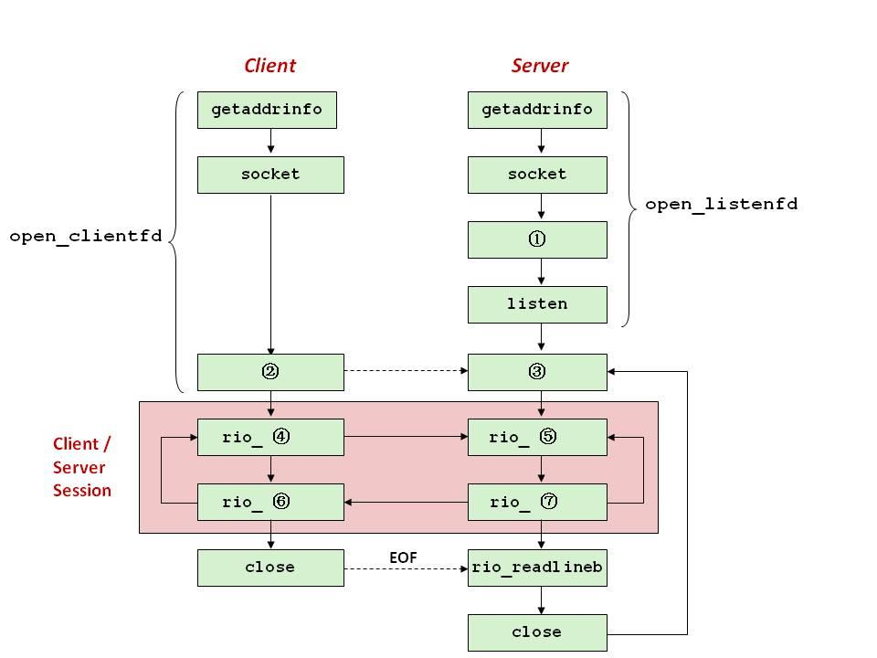

# 2019期末-无答案

> 来源：`往年题/期末/2019期末-无答案.pdf`　共 16 页

<!-- ===== page 1 ===== -->

北京大学信息科学技术学院考试试卷
考试科目：计算机系统导论 姓名：         学号：
考试时间：2019年 12月 30日小班号：  小班教师:
题号  一  二  三  四  五  六  七  总分
分数
装
阅卷人
订
线
  北京大学考场纪律
内
     1、考生进入考场后，按照监考老师安排隔位就座，将学生证放在桌面上。
    无 学生证者不能参加考试；迟到超过15分钟不得入场。在考试开始30分钟后
    方 可交卷出场。
     2、除必要的文具和主考教师允许的工具书、参考书、计算器以外，其它
    所 有物品（包括空白纸张、手机、或有存储、编程、查询功能的电子用品等）
   不得带入座位，已经带入考场的必须放在监考人员指定的位置。
    3、考试使用的试题、答卷、草稿纸由监考人员统一发放，考试结束时收
   回，一律不准带出考场以。下若有以试下题为印答制题问纸题，请向共监  考  教页师 提出，不得向其他考
生 询问。提前答完试卷，应举手示意请监考人员收卷后方可离开；交卷后不得
不
在 考场内逗留或在附近高声交谈。未交卷擅自离开考场，不得重新进入考场答
要 卷 。考试结束时间到，考生立即停止答卷，在座位上等待监考人员收卷清点后，
方 可离场。
答
  4、考生要严格遵守考场规则，在规定时间内独立完成答卷。不准交头接
题 耳，不准偷看、夹带、抄袭或者有意让他人抄袭答题内容，不准接传答案或者
  试卷等。凡有 违纪作弊者，一经发现，当场取消其考试资格，并根据《北京大
学本科考试工 作与学术规范条例》及相关规定严肃处理。
5、考生须确认自己填写的个人信息真实、准确，并承担信息填写错误带
来的一切责任 与后果。
学校倡议所有考生以北京大学学生的荣誉与诚信答卷，共同维护北京大
学的学术声誉 。
以下为试题和答题纸，共  16  页。
1

<!-- ===== page 2 ===== -->

得分
注：所有回答请填写在答题纸上,并注明大题和小题的题号。
第一题 单项选择题（每小题2分，共40分）
注：请在答题纸上按照下表样式画出表格并填写答案。
题号  1  2  3  4  5  6  7  8  9  10
回答
题号  11  12  13  14  15  16  17  18  19  20
回答
1.  已知浮点运算表达式：t = a + b; x = t + c; y = d + t; 下列
表达式中，x, y不能都得到相同的计算结果的是：
A. x = a + b + c; y = d + a + b;
B. x = a + b + c; y = d + (a + b);
C. x = c + (a + b); y = a + b + d;
D. x = (a + b) + c; y = d + (a + b);
2.  在本课程的PIPE流水线中，下列情况会出现数据冒险的是：
A. 当前指令会改变下一条指令的目的操作数
B. 当前指令会改变下一条指令的源操作数
C. 下一条指令会改变当前指令的目的操作数
D. 下一条指令会改变当前指令的源操作数
3.  int x = -2019;
int a = (x / 8) * 8;
int b = ((x + 7) >> 3) << 3;
int c = -(((~x)+1) >> 3) << 3;
a, b, c大小关系是什么？
A. a=b, b=c
B. a=b, b>c
C. a<b b<c
D. a<b, b=c
4.  下述关于RISC和CISC的讨论，哪个是错误的
A. RISC指令集包含的指令数量通常比CISC的少
B. RISC的寻址方式通常比CISC的寻址方式少
C. RISC的指令长度通常短于CISC的指令长度
D. 手机处理器通常采用RISC，而PC采用CISC
5.  下述关于各类存储介质的讨论，哪个是错误的？
2

<!-- ===== page 3 ===== -->

A. 磁盘访问的延时和数据所在位置有关，连续数据访问的性能高于随机
数据访问
B. DRAM是动态随机存储器，连续数据访问和随机数据访问延时是一样的
C. 对SSD设备进行数据擦除操作的延时，远高于进行数据读取的延时
D. SRAM是静态随机存储器，它的存储密度比DRAM、SSD都要低
6.  在链接时，对于下列哪些符号需要进行重定位？
(1) 不同C语言源文件中定义的函数
(2) 同一C语言源文件中定义的全局变量
(3) 同一函数中定义时不带static的变量
(4) 同一函数中定义时带有static的变量
A. (1)(3)    B. (2)(4)    C. (1)(2)(4)    D. (1)(2)(3)(4)
7.  关于x86-64系统中的异常，下面那个判断是正确的：
A. 除法错误是异步异常，Unix会终止程序；
B. 键盘输入中断是异步异常，异常服务后会返回当前指令执行；
C. 缺页是同步异常，异常服务后会返回当前指令执行；
D. 时间片到时中断是同步异常，异常服务后会返回下一条指令执行；
8.  考虑4个具有如下开始和结束时间并运行在不同处理器上的进程，
进程  开始时间  结束时间  运行处理器
A  5  7  P0
B  2  4  P1
C  3  6  P0
D  1  8  P1
下面那个判断是正确的。
A. 进程A和B不是并发运行的，但是并行运行的；
B. 进程A和C是并发运行的，并且是并行运行的；
C. 进程B和D是并发运行的，但不是并行运行的；
D. 进程A和D是并发运行的，并且是并行运行的；
9.  进程管理相关函数的调用和返回行为，下列那些函数都是可能返回多于一
次的？
A. longjmp和fork
B. execve和longjmp
C. fork和setjmp
D. setjmp和execve
10. 根据本课程介绍的Intel x86-64存储系统，填写表格中某一个进程从
用户态切换至内核态时，和进程切换时对TLB和cache是否必须刷新。
A. ①不必刷新 ②不必刷新 ③刷新 ④不必刷新
B. ①不必刷新 ②不必刷新 ③不必刷新 ④不必刷新
C. ①刷新 ②不必刷新 ③刷新 ④刷新
D. ①刷新 ②不必刷新 ③不必刷新 ④刷新
3

<!-- ===== page 4 ===== -->

11. 已知某系统页面长2KB，页表项8字节，采用多层分页策略映射48位虚
拟地址空间。若限定最高层页表占1页，则它可以采用多少层的分页策略？
A. 3层
B. 4层
C. 5层
D. 6层
12. 现在有一个用户程序执行了如下调用序列
void *p1 = malloc(16);
void *p2 = malloc(32);
void *p3 = malloc(32);
void *p4 = malloc(48);
free(p2);
void *p5 = malloc(4);
free(p3);
void *p6 = malloc(56);
void *p7 = malloc(10);
内存分配器内部使用显式空闲链表实现，按照地址从低到高顺序来维护空
闲链表节点顺序。分配块格式参照上图。每个分配块 16 字节对齐，头部和脚
部的大小都是4字节。分配算法采用首次适配算法，将适配到的空闲块的第一
部分作为分配块，剩余部分变成新的空闲块，并采用立即合并策略。假设初始
空闲块的大小是1KB。那么以上调用序列完成后，分配器管理的这1KB内存
区域中，内部碎片的总大小是____，链表里第一个空闲块的大小是_____。
A. 58Byte，848Byte
B. 26Byte，32Byte
C. 74Byte，48Byte
D. 74Byte，16Byte
13. 在一个具有TLB和高速缓存的系统中，假设地址翻译使用四级页表来进行，
且不发生缺页异常，那么在CPU访问某个虚拟内存地址的过程中，至少会
访问（ ）次物理内存，至多会访问（ ）次物理内存。
A. 0，4
B. 0，5
C. 1，4
D. 1，5
14. 采用迭代的Echo 服务器服务多个客户端，假设client1 先完成连接，
并且没有结束，那么 client2 向服务器发出连接请求后，会被阻塞在下
列哪个函数上？
A. connect
4

<!-- ===== page 5 ===== -->

B. read
C. write
D. socket
15. 下列关于全球IP因特网的各种概念叙述中，哪一个是错误的？
A. 一个套接字是连接的一个端点，对应了一个套接字地址
B. IPv4的因特网中，一个IP地址是一个32位无符号整数
C. 因特网主机的字节顺序与TCP/IP定义的网络字节顺序是一致的
D. IP协议提供了一种不可靠的从一台主机向其他主机的递送机制
16. 下列关于Web服务器向客户端提供动态内容（遵从CGI标准）的叙述
中，哪一个是错误的？
A.  客户端提出的GET请求的参数在URI中传递，并用“&”字符分隔文
件名和多个参数
B.  接到客户端的请求，Web 服务器创建一个子进程执行相应的 CGI 程
序
C.  通过设置环境变量，Web服务器将URI中传递的参数传递给子进程
D.  CGI程序将动态内容重定向到与客户端关联的已连接描述符connfd
17. 并发程序执行时会遇到下列各种情况：
①   程序执行结果的正确性依赖于一个线程要在另一个线程到达y点之
前到达其控制流的x点
② 程序员使用P和V操作顺序不当
③ 外部事件和/或系统调度决策阻止了任务进度
④ 不合理的资源分配策略导致程序难以向前运行
⑤ 程序的执行结果取决于系统的调度决策
⑥ 在信号处理函数中调用printf()
请问下列哪些情况表示可能产生死锁现象？
A.  ①、②和⑤
B.  ②、③和④
C.  ③、④和⑥
D.  ②、④和⑥
18. 称一个函数为线程安全的（thread-safe），当且仅当该函数被多个并
发线程反复调用时会一直产生正确的结果。下列哪些函数不是线程安全
的？
A.  利用P、V操作保护了共享变量的函数
B.  保持跨越多个调用的状态的函数
C.  包括了调用者传递存放结果变量的地址的函数
D.  可重入函数
19. 在以下基于线程的并发Echo服务器代码中，哪一个代码片段会潜在引发
不正确的程序执行结果？
A.  int main(int argc, char **argv)
{                              /*假设有配对的”}”
        int listenfd, connfd;
5

<!-- ===== page 6 ===== -->

        socklen_t clientlen;
        struct sockaddr_storage clientaddr;
        pthread_t tid;
B. listenfd = Open_listenfd(argv[1]);
C. while (1) {
      connfd = Accept(listenfd, (SA *) &clientaddr,
&clientlen);
      Pthread_create(&tid, NULL, thread, &connfd);
    }
D. void *thread(void *vargp)
{
      int connfd = *((int *)vargp);
      Pthread_detach(pthread_self());
      echo(connfd);
      Close(connfd);
      return NULL;
}
20. 下列关于信号量及P、V操作的叙述中，哪一个是不正确的？
A.  信号量是一个非负整数，对信号量只能执行P操作和V操作
B.  当信号量的值为0时，调用P操作的线程被挂起
C.  P(s)的实现代码中语句：while (s == 0)  wait(); s--; 应
该由内核保证其执行的不可分割性
D.  在保护临界区的解决方案中使用 sem_wait()和 sem_post()比使
用 pthread_mutex_lock()和 pthread_mutex_unlock()性能
好
6

<!-- ===== page 7 ===== -->

得分
第二题（10分）
现有如下汇编代码段，相关寄存器的初始值也在右侧表格中给出:
.L2:
    movq    (%rdi), %rbx
    addq    %rbx, %rax  %rdi  0x8008
    addq    $8, %rdi  %rax  0
    addq    $1, %rcx  %rbx  0
    cmpq    $8, %rcx  %rcx  0
    jl     .L2
（1）  请在下面C代码中，补充缺失的部分。
  for(i=0; i<_____ ; i++)
  {
    sum=sum+a[i];
  }
（2）  现有一个类似课上SEQ的处理器来运行上述汇编代码，在理想情况下，其
每个周期可以处理完一条汇编代码，请计算：理想情况下，执行完上述代码段
（即结束循环）一共需要多少周期？
（3）  现在考虑数据缓存（data cache）对该处理器的影响。
该处理器配置了一个简单的直接映射（direct-mapped，E=1）数据缓存，
总容量32KB，每个缓存块的大小是64Byte。对于movq指令，如果被访问
的数据在该缓存中，则1个周期可以处理完成。否则，则需要2个周期才能完
成。在运行上述汇编代码之前，数据缓存初始状态为空，其他设置同上一问。
请再次计算：完成上述汇编代码段一共需要多少周期？
（4）  为了提升处理器的性能，增加了一个加法器。因此，在没有数据依赖、并
且不改变指令顺序的情况下，新的处理器可以同时处理两个addq指令、或者
一个addq加一个compq指令。注意：movq和跳转指令仍旧需要单独执行，
其他设置同上一问。请再次计算：完成上述汇编代码段一共需要多少周期？
（5）  为了进一步减少处理时间，程序员将代码进行循环展开，新的代码如下：
.L2:
movq    (%rdi), %rbx
movq    8 (%rdi), %rdx
addq    %rbx, %rax
7

<!-- ===== page 8 ===== -->

addq    %rdx, %rax
addq    $16, %rdi
addq    $2, %rcx
cmpq    $8, %rcx
jl     .L2
假设在不影响程序正确性的情况下，可以调整上述指令的顺序，请问最
短需要多少个周期可以完成该代码段（注：其他设置和上一问相同）。
8

<!-- ===== page 9 ===== -->

得分
第三题（10分）
本题基于下列m.c及foo.c文件所编译生成的m.o和foo.o，编译和运行
在x86-64/Linux下完成，编译过程未加优化选项。
//m.c  //foo.c
void myswap();  extern int buf[];
char buf[2] = {1, 2};  char *bufp0;
void *bufp0;  ......//略去题目无关代码
void *bufp1;  char *bufp1 = &buf[1];
char temp;  void myswap(char temp){
int main(){  static int count = 0;
......//略去题目无关代码
......//略去题目无关代码
myswap(temp);  bufp0 = &buf[0];
......//略去题目无关代码  temp = *bufp0;
    return 0;  ......//略去题目无关代码
}  *bufp0 = *bufp1;
  *bufp1 = temp;
......//略去题目无关代码
count++;
}
（1）  对于每个foo.o中定义和引用的符号，请用“是”或“否”指出它是
否在模块foo.o的.symtab节中有符号表条目。如果存在条目，则请指出在
模块foo.o中的符号类型（局部、全局或外部）、它在foo.o模块中所处的
节（.data、.text、.bss 或 COMMON）以及其强弱信息（强、弱、非强非
弱）；如果不存在条目，则请将该行后继空白处标记为“/”（请将下表画到答
题纸上）。
符号  .symtab条目?  符号类型  节  强弱
bufp1  是  全局  .data  强
buf
bufp0
temp
count
（2）  我们使用 REF(myswap.m)->DEF(myswap.foo)表示链接器将把
模块m中对符号myswap的任意引用与模块foo中对swap的定义关联起来。
对于下面的示例，用这种方法来说明链接器如何解析每个模块对多重定义符号
的引用。如果有链接时错误，请标记“错误”。如果链接器从定义中任意选择一
个，请标记“未知”。
a) REF(bufp0.m)  ->DEF(________________)
b) REF(bufp1.m)  ->DEF(________________)
（3）  下图左边给出了m.o和foo.o的反汇编文件，右边给出了采用某个
配置链接成可执行程序后再反汇编出来的文件。根据答题需要，其中的信息略
有删减。
9

<!-- ===== page 10 ===== -->

0000000000......<main>:  0000000000000f28 <main>:
5458   8 9   e 5                          mpouvs h      %%rrbspp, %rbp  ff2289::    5458   8 9   e 5                           pmuosvh       %%rrsbpp, %rbp
4.8. .8.3. .e c 10         sub     $0x10,%rsp  f.2.c.:. . .4略8去 8部3 分ec和 答10题  无  关  的  信 s息u.b.  . . . .$ 0x10,%rsp
be88  0000  0000  0000  0000           m ocva l l q  $ 01xa0 ,<%meaaixn +0x1a>    ff 33 8d ::        be88  00   0 0  0 0  ①00           m o v       $ 0cxa0l,l%qe a x1 000
①  <myswap>
......  ......略去部分和答题无关的信息......
c9                   leaveq  ffd:  c9                     leaveq
c 3                   req  f.f.e.:. . .c略3去   部 分  和  答  题  无   关 的  信  息 r.e.t.q. ..
0000000000......<myswap>:  0000000000001000 <myswap>:
55                   push   %rbp  1000:  55                    push   %rbp
4.8. .8.9. .e 5             mov    %rsp,%rbp  1.0.0.1.:. . 略4去8 部89分 e和5答  题  无  关  的  信  息 m.o.v. . .  .% rsp,%rbp
4  8   c 7    0 5   0  0   0 0   0  0   0 0  00 00 00 00  1m0o0vdq :    4  8② c 7  ,005x ????? ??(?% r?i?p )? ? ?? ?? ?? ??
movq   $0x0,0x0(%rip)        ③②  10051 8?:?  ?? ?? ?? mo v    0x????(4%8r ip),%rax  8b
4④08f   8bb6  0050  0 0    0 0   0 0   0 0   mmoovv z b l  0(x%0r(a%xr)i,p%)e,a%xr ax    11 00 11 f8::    08f8  b465  00f c                       m o v z bmlo v( % r a x%)e,a%xe,ax-
8.8. .4.5. .f c              mov    %al,-0x4(%rbp)  0.x.4.(.%.r.略bp去) 部分和答题无关的信息......
4⑤8  8b 05 00 00 00 00 mov    0x0(%rip),%rax    10 0x 3? 5?:? ?(% ri4p8) ,%r8abx   05  ??  ??  ??  ??  mov
48 8b 15 00 00 00 00 mov    0x0(%rip),%rdx    1 0 3 c:  48 8b 15 ?? ?? ?? ?? mov     ⑥
⑥  (%rip),%rdx
08f8  b160   1 2                             mmoovv z b l  %(d%lr,d(x%)r,a%xe)d x  1(0%4r3d:x ), %0efd x b6 12               movzbl
4⑦8  8b 05 00 00 00 00 mov    0x0(%rip),%rax    11 00 44 68::   8 8 1408     8 b     0 5     ?  ?   m?o?v    ? ?% dl,?(?% ramxo)v
0f b6 55 fc           movzbl -0x4(%rbp),%edx  0x????(%rip),%rax
8.8. .1.0. .                 mov    %dl,(%rax)  100x44f(:% rb p0)f, %ebd6x  55 fc           movzbl -
8⑧b  05 00 00 00 00    mov    0x0(%rip),%eax    1. 0. 5. 3.:. . 略8去8 部10分  和  答  题  无  关  的  信  息  .m.o.v. . .   %dl,(%rax)
83 c0 01              add    $0x1,%eax  100x5?7?:? ?( %r8ibp ),0%5e ax? ?  ??  ??  ??            mov
8⑨9  05 00 00 00 00    mov    %eax,0x0(%rip)    1 0 5 d:  83 c0 01               add    $0x1,%eax
90                     nop  1060:  89 05 ?? ?? ?? ??    mov    %eax,  ⑨
5d                     pop    %rbp  (1%0r6i6p:)   90                      nop
c 3                     retq  1067:  5d                      pop    %rbp
1.0.6.8.:. . 略c去3 部  分  和  答  题  无  关  的  信  息  . r.e.t.q..
0.0.0.0.0.0.略00去00部00分a和00答0题 <无bu关f>的:信 息......
0.0.0.0.0.0.略00去00部00分a和05答0题 <无bu关fp的1信>:息 ......
0.0.0.0.0.0.略00去00部00分c和b2答4题 <无co关un的t信.1息83.7.>.:.. .
0.0.0.0.0.0.略00去00部00分c和b2答8题 <无bu关fp的0信>:息 ......
在上图中对所涉及到的重定位条目进行用数字①至⑨进行了标记，请根据下表
中所提供的重定位条目信息，计算相应的重定位引用值并填写下表。（请将下
表的第1列和第3列画到答题纸上）
编号  重定位条目信息  应填入的重定位引用值
r.offset = 0x16             r.symbol = 本题不提供
①  r.type = R_X86_64_PC32     r.addend = -4
②  rr..otfyfpsee t=  =R _0Xx8164_ 6 4 _ 3 2               rr..asdydmebnodl  ==  +b0u f
⑥  rr..otfyfpsee t=  =R _0Xx836f_ 6 4 _ P C  3 2          rr..saydmdbeonld  ==  b-u4f p1
r.offset = 0x62             r.symbol = 本题不提供
⑨  r.type = R_X86_64_PC32     r.addend = -4
10

<!-- ===== page 11 ===== -->

得分
第四题（10分）
分析以下C程序，其中f1.txt和f2.txt为已有用户有读写的文件，初始文
件内容为空。
1.  #include <stdio.h>
2.  #include <stdlib.h>
3.  #include <sys/types.h>
4.  #include <sys/stat.h>
5.  #include <fcntl.h>
6.  #include <unistd.h>
7.  #include <sys/types.h>
8.  #include <sys/wait.h>
9.
10. int main()
11. {
12.   int fd1,fd2,fd3,fd4;
13.   int pid;
14.   int c=1;
15.   fd1=open("./f1.txt",O_WRONLY,0);
16.   fd2=open("./f1.txt",O_WRONLY,0);
17.
18.   printf("fd1=%d,fd2=%d;\n",fd1,fd2);
19.
20.   write(fd1,"EECSPKU",7);
21.   write(fd2,"2019",4);
22.
23.   close(fd2);
24.
25.   fd3=open("./f2.txt",O_WRONLY,0);
26.   fd4=dup(fd3);
27.
28.   printf("fd3=%d,fd4=%d;\n",fd3,fd4);
29.
30.   pid=fork();
31.   if((pid==0)) {
32.     c--;
33.     write(fd3,"PKU",3);
34.     write(fd4,"ICS",3);
35.     printf("c= %d\n",c);
36.   }
37.   else {
38.     waitpid(-1,NULL,0);
39.     c++;
40.     write(fd3,"2019",4);
11

<!-- ===== page 12 ===== -->

41.     close(fd3);
42.     close(fd4);
43.     printf("c= %d\n",c);
44.   }
45.
46.   if(c)
47.    write(fd1,"CS",2);
48.   c++;
49.   close(fd1);
50.   printf("c=%d\n",c);
51. }
当程序正确运行后，填写输出结果：
（1）  程序第18行：fd1=   ①    ，fd2=    ②   ；
（2）  程序第28行：fd3=   ①    ，fd4=    ②   ；
（3）  程序第35、43、50行输出c的值依次分别为：                     ；
（4）  文件f1.txt中的内容为：                ；
（5）  文件f2.txt中的内容为：                 。
12

<!-- ===== page 13 ===== -->

得分
第五题（10分）
某32位机器有24位地址空间，采用二级页表，一级页表中有64个PTE，二
级页表中有1024个PTE，一级页表4KB对齐，PTE最高一位是有效位，没有
TLB和Cache。惠楚思程序员在该机器上执行了如下代码。
1. int* a=calloc(10000, sizeof(int));
2. int* b = a+5000;
3. fork();
4. *b=0x80C3F110;
（1）  假设编译后 b 的值保存在寄存器中，请问该机器页面大小为○1__字
节，VPN1长度为○2____，VPN2长度为○3____。
（2）  由于该执行结果不符合预期，惠楚思需要对程序执行过程进行还原。
程序执行过程中硬件记录了部分内存访问记录，但访问记录并不完整。目前已
知在父进程执行第四行的时候，进行了若干次物理内存的读写操作，其中第一
次读内存操作从地址 0x67F0E8 读出 0x80AA32C4，另外有两次将
0x80C3F110写入内存的操作，写入的地址分别是0xC3F50D和0xAA3AD0，
但写入顺序并不清楚。程序结束后变量b中保存的值是○1____________。在
解析“*b”的过程中，一级页表的起始地址为○2               ；二级页表
的起始地址为○3               ；物理页面的起始地址为○4               。
（地址均用16进制表示）
13

<!-- ===== page 14 ===== -->

得分
第六题（10分）
下图是一个基于echo服务器的client-server框架
（1）  请给图中的编号填写相应的函数名。
（2）  请补全下面server端open_listenfd函数中缺失的操作（Line 21, Line
26和Line 34）
Line 1:  int open_listenfd(char *port)
Line 2:  {
Line 3:     struct addrinfo hints, *listp, *p;
Line 4:     int listenfd, optval=1;
Line 5:     /* Get a list of potential server addresses */
Line 6:     memset(&hints, 0, sizeof(struct addrinfo));
Line 7:     hints.ai_socktype = SOCK_STREAM;
Line 8:     hints.ai_flags = AI_PASSIVE | AI_ADDRCONFIG;
Line 9:     hints.ai_flags |= AI_NUMERICSERV;
Line 10:    Getaddrinfo(NULL, port, &hints, &listp);
14

<!-- ===== page 15 ===== -->

Line 11:
Line 12:     for (p = listp; p; p = p->ai_next) {
Line 13:         /* Create a socket descriptor */
Line 14:        if ((listenfd = socket(p->ai_family, p->ai_socktype,
Line 15:                                    p->ai_protocol)) < 0)
Line 16:           continue;  /* Socket failed, try the next */
Line 17:         /* Eliminates "Address already in use" error from
bind */
Line 18:         Setsockopt(listenfd, SOL_SOCKET, SO_REUSEADDR,
Line 19:                    (const void *)&optval , sizeof(int));
Line 20:
Line 21:         if (_⑧_(listenfd, p->ai_addr, p->ai_addrlen) == 0)
Line 22:           break;  /* Success */
Line 23:         Close(listenfd);
Line 24:     }
Line 25:     /* Clean up */
Line 26:     Freeaddrinfo(___⑨___);
Line 27:     if (!p) /* No address worked */
Line 28:         return -1;
Line 29:
Line 30:     if (listen(listenfd, LISTENQ) < 0) {
Line 31:         Close(listenfd);
Line 32:         return -1;
Line 33:     }
Line 34:     return __⑩___;
Line 35:  }
15

<!-- ===== page 16 ===== -->

得分
第七题（10分）
解决第一类读者-写者问题的代码如下：
int readcnt;    /* Initially 0 */
sem_t mutex, w; /* Both initially 1 */
void reader(void)
{
(1)    while (1) {
(2)      P(&mutex);
(3)      readcnt++;
(4)      if (readcnt == 1) /* First in */
(5)        P(&w);
(6)      V(&mutex);
(7)         /* Reading happens here, need 7 time unit */
(8)      P(&mutex);
(9)      readcnt--;
(10)     if (readcnt == 0) /* Last out */
(11)        V(&w);
(12)     V(&mutex);
        }
}
void writer(void)
{
(13)  while (1) {
(14)    P(&w);
(15)       /* Writing here, need 8 time unit */
(16)    V(&w);
      }
}
假设有5个读者或写者到来，到达时刻和所需的时间如下：
线程  到达时刻  读写时间
R1  0  7
W1  1  8
R2  2  7
W2  4  8
R3  5  7
注意，为简单起见，只考虑读写时间，忽略所有其他时间（包括代码中其
他语句的执行时间、线程切换、调度等等），亦假设没有更多的读者或写者或
其他线程。
（1）在时刻3时，R1、W1和R2所处的位置，请标出对应的代码行号。此刻，
readcnt和w的值分别是多少？R1: ；W1: ；R2: ；readcnt: ；w: 。
（2）在时刻6时，W2和R3所处的位置，请标出对应的行号。此刻，readcnt
和w的值分别是多少？W2: ；R3: ；readcnt: ；w: 。
（3）如果不使用P(&mutex)和V(&mutex)，程序执行会不会出错？如果出
错，会出什么错？
16
