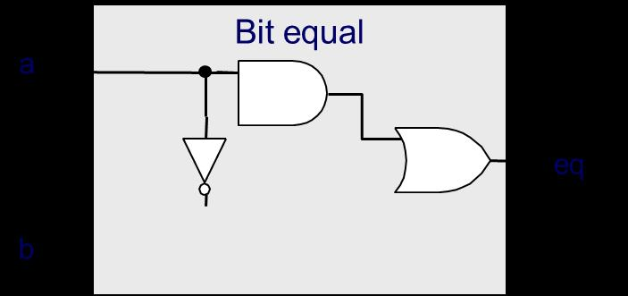
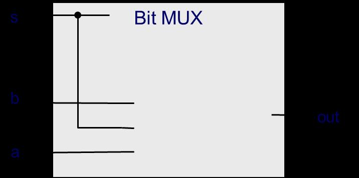
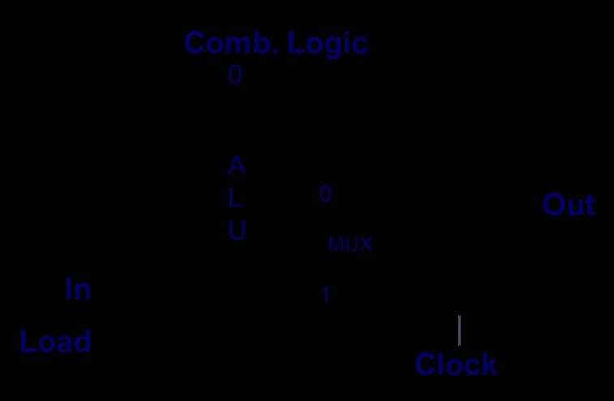
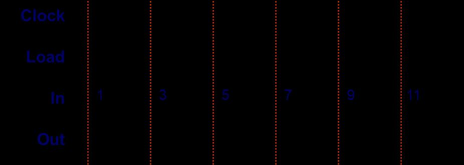
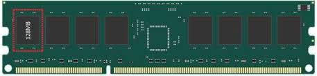

# 2025第2次阶段测验-无答案

> 来源：`往年题/阶段测验/2025第2次阶段测验-无答案.pdf`　共 10 页

<!-- ===== page 1 ===== -->

北京大学信息科学技术学院考试试卷
考试科目：计算机系统导论 姓名： 学号：
考试时间：2025年 11 月 17 日 大班号： 小班号：
题号 9 10 11 12 13 14/15 16/17 总分
分数
阅卷
人
北京大学考场纪律
1、考生进入考场后，按照监考老师安排隔位就座，将学生证放在桌面上。无学生证
以下以下为答题纸，共 页
者不能参加考试；迟到超过15分钟不得入场。在考试开始30分钟后方可交卷出场。
2、除必要的文具和主考教师允许的工具书、参考书、计算器以外，其它所有物品（包
括空白纸张、手机、或有存储、编程、查询功能的电子用品等）不得带入座位，已经带入
考场的必须放在监考人员指定的位置。
3、考试使用的试题、答卷、草稿纸由监考人员统一发放，考试结束时收回，一律不
准带出考场。若有试题印制问题请向监考教师提出，不得向其他考生询问。提前答完试卷，
应举手示意请监考人员收卷后方可离开；交卷后不得在考场内逗留或在附近高声交谈。未
交卷擅自离开考场，不得重新进入考场答卷。考试结束时间到，考生立即停止答卷，在座
位上等待监考人员收卷清点后，方可离场。
4、考生要严格遵守考场规则，在规定时间内独立完成答卷。不准交头接耳，不准偷
看、夹带、抄袭或者有意让他人抄袭答题内容，不准接传答案或者试卷等。凡有违纪作弊
者，一经发现，当场取消其考试资格，并根据《北京大学本科考试工作与学术规范条例》
及相关规定严肃处理。
5、考生须确认自己填写的个人信息真实、准确，并承担信息填写错误带来的一切责
任与后果。
学校倡议所有考生以北京大学学生的荣誉与诚信答卷，共同维护北京大学的学术声
誉。
以下为试题和答题纸，共 页。
1

<!-- ===== page 2 ===== -->

注意事项（务必阅读）：
（1）本试卷基本按照大班课程讲授次序分组，不是按照题目难度排序。题量较大，注意合
理安排时间。
（2）除特别说明外，默认技术前提是本课程课件和对应教材内容，例如：x86-64体系结构、
Linux操作系统、C语言程序等；汇编程序是对应C程序主体功能实现，不做高级别优化，
不一定是完整代码。
（3）涉及Y86-64体系结构时，采用课程中讲授的SEQ和PIPE等处理器结构。
（4）不定项选择题全部答对才得分。
（5）在试卷上指定位置答题，包括冒号后、等号后、箭头后、横线上、括号里等。
第9讲（12分）得分：
1. （不定项选择，2分）以下描述，哪些属于ISA规定的内容：
A. 有15个通用寄存器，每个寄存器64位
B. 有3个条件码，分别是ZF、SF、OF
C. 过程调用指令（call）会将下一条指令地址压入栈中
D. 过程调用的前2个参数放在寄存器rdi、rsi
E. 过程调用返回值放在寄存器rax
F. 内存是字节寻址的，字节序采用小端法
G. 访存指令支持寄存器加偏移的寻址模式
2. （2分）Y86-64中的这两条指令：
rmmovq rA,D(rB)
mrmovq D(rB),rA
第2条指令为什么不设计成mrmovq D(rA),rB？这样都是rA在前rB在后，看起来
更加规整。
答：
3. （各3分，共6分）根据HCL表达式补全电路图
(1)bool eq = (a&&b)||(!a&&!b)
2

<!-- ===== page 3 ===== -->

(2)bool out = (s&&a)||(!s&&b)
4. （2分）根据下面左边电路图，补全右边时序图里Out信号的值（In/Out均用10进
制表示）
第10讲（16分）得分：
5. （8分）Y86-64的popq指令编码格式如下：
根据popq指令的操作，补全下表（共需填8行9空）
6. （8分）以下是SEQ处理器中ALU的A口输入端信号（aluA）生成逻辑的分析，只列
出了部分指令。根据各指令功能，并参考下面已经给出的信息，补全空缺（表格中2
空，HCL代码中6空）。
3

<!-- ===== page 4 ===== -->

int aluA = [
icode in { IRRMOVQ, } : valA;
icode in { IIRMOVQ, , IMRMOVQ } : valC;
icode in { , IPUSHQ } : ;
icode in { , IPOPQ } : ;
# Other instructions don't need ALU
];
第11讲（16分）得分：
7. （4分）如下图所示的三级流水线结构，单条指令的延迟（delay）是 ps，
流水线满负荷运转时，每 ps完成一条指令。如果能理想化地进一步细分流水级
（不跨现有流水级重排电路、也不过度细分），恰好划分成均衡流水线，那单条指令的
延迟（delay）是 ps，流水线满负荷运转时，每 ps完成一条指令。
8. （6分）阅读下面这段Y86-64汇编代码
1 irmovq $1,%rax
2 irmovq $2,%rax
3 irmovq $3,%rdx
4 addq %rax,%rdx
4

<!-- ===== page 5 ===== -->

当这段代码在PIPE处理器上运行时，当addq指令在流水级 阶段时，会
检测到数据冒险。此时运用了数据前递技术，其中在流水级 阶段的指令前
递数据 作为操作数%rax的值。
9. （4分）写出一段存在Load-use相关的Y86-64汇编代码（要求代码简洁明了），
并说明能否用数据前递技术解决，为什么？
答：
10.（2分）写出一段存在Load-use相关和ret组合的Y86-64汇编代码（要求代码简
洁明了）。
答：
第12讲（14分）得分：
11.（2分）对比同样容量的SRAM和DRAM，功耗更高是 ，价格更低是 。
12.（判断对错，2分）ROM是只读存储器的简称，是非易失性存储器，掉电不会丢失数据，
只能读不能写。对还是错：（ ）
13.（4分）下图是一根DDR3SDRAM内存条，数据位宽是64-bit，总容量为2GB，由8
颗内存芯片构成。如果一个计算机系统只有这根内存条作为全部内存，那往地址
0x01001000写一个64-bit数0x12345678，这个数会放在内存条上从左向右数第
几颗（或哪几颗）内存芯片中？并解释这样存放的原因。
答：
14.（不定项选择，2分）机械硬盘和固态硬盘（SSD）对比，在主流产品形态下，下列属
于后者特点的是：
A. 速度快
B. 抗震耐摔
C. 运行噪音小
D. 体积小
5

<!-- ===== page 6 ===== -->

E. 同样容量的价格更低
F. 支持写入的寿命更长
15.（4分）下面这段代码哪些地方体现了局部性原理？分别体现了什么类型的局部性。
int sum_array_rows(int a[M][N])
{
int i, j, sum = 0;
for (i = 0; i < M; i++)
for (j = 0; j < N; j++)
sum += a[i][j];
return sum;
}答：
第13讲（16分）得分：
16.（6分）高速缓存（Cache）的三种未命中（Miss）是什么，分别说明出现的场景。
答：（1）
（2）
（3）
17.（8分）有一个计算机系统，存储地址空间为64字节；采用直接映射（Direct-mapped）
的数据高速缓存（cache），其容量为16字节；每个高速缓存块（cache block）
为 4 字节（B=4Byte/block）；采用写分配（write-allocate）、写返回
（write-back）策略。Cache的当前状态如下表。
v Tag Block
set0
set1 1 01 Mem[4-7]
set2
经过如下s地et址3访问序列后（十进制表示，每次访问1个字节）：18 40 50 16 43 48，
在上表中更新Cache的状态。这个序列过程中，该高速缓存发生 次Hit和 次Miss。
6

<!-- ===== page 7 ===== -->

18.（2分）Intel Core i7 CPU的L2 Cache容量，最有可能是下面哪种：（ ）
ABC... 432k25Bk6BkB
D. 8MB
第14/15讲（14分）得分：
19.（4分）编译优化时会有两种限制情况，分别解释说明原因。
答：（1）为什么有“过程调用”限制：
（2）为什么有“存储器别名”限制：
20.（不定项选择，2分）下面这段代码中，属于链接器要解析的符号包括：
AE..ipnrcilnutd_evalBu.estdFi.ox.hG.Cm.aiinnt HD..vcanlt
-#-i-n-c-l-u-d-e--<s--td--io--.h-->----------------------------
ienxttercnntvo=id10;print_value(int x);
intimnatinv(a)l {= 5;
prreitnutr_nva0;lue(val + cnt);
21.}（8分）下面是一段C代码main.c和对应目标文件main.o反汇编得到的代码。
-i-n-t--a-r-r-a-y-[-2-]--=--{1--,--2}--;------------------------
intimnatinv(ailnt= asrugmc(,arcrhaayr,**2)a;rgv){
} return val;
-0-0-0-0-0-0-0-0-0-0-0-0-0-0-0-0--<m--ai--n>--:------7----------------

<!-- ===== page 8 ===== -->

0: 55 push %rbp
1: 48 89 e5 mov %rsp,%rbp
4: 48 83 ec 20 sub $0x20,%rsp
8: 89 7d ec mov %edi,-0x14(%rbp)
b: 48 89 75 e0 mov %rsi,-0x20(%rbp)
f: be 02 00 00 00 mov $0x2,%esi
14: bf 00 00 00 00 mov $0x0,%edi
19: e8 00 00 00 00 callq 1e <main+0x1e>
1e: 89 45 fc mov %eax,-0x4(%rbp)
21: 8b 45 fc mov -0x4(%rbp),%eax
24: c9 leaveq
25: c3 retq
----------------------------------------------
（1）地址14对应的mov指令，为什么要把0放到edi寄存器中?按源代码看，应该
是要放什么数，这里为什么是0，后续还会有什么操作？
答：
（2）地址19对应的callq指令，看起来会转到地址1e，即下一条指令，这不合常
理，为什么？
答：
第16/17讲（12分）得分：
22.（3分）整数运算中有可能会出现“除0异常”，如果这是属于Faults类型的异常，
是否可以在异常处理程序中，将结果修改成某个特殊值，例如全为1的二进制数，然
后继续执行该程序后续指令？
答：
23.（3分）阅读下面这段程序
#include <stdio.h>
8

<!-- ===== page 9 ===== -->

#include <unistd.h>
int main() {
printf("A\n");
pid_t pid = fork();
if (pid == 0) {
printf("B\n");
} else {
printf("C\n");
fork();
}
printf("D\n");
return 0;
}
该程序正常运行后，问
（1）会输出几次 D：
（2）B和C哪个先输出：
（3）ACDBDD这个输出序列是否可能：是（ ）否（ ）
24.（6分）阅读下面这段程序
#include <stdio.h>
#include <unistd.h>
#include <sys/wait.h>
int x = 1;
int main() {
printf("start: x = %d\n", x);
pid_t pid1 = fork();
if (pid1 == 0) {
x += 1;
printf("x = %d\n", x);
sleep(1);
pid_t pid2 = fork();
if (pid2 == 0) {
x += 2;
printf("x = %d\n", x);
} else {
x += 3;
9

<!-- ===== page 10 ===== -->

printf("x = %d\n", x);
wait(NULL);
}
} else {
x += 4;
printf("x = %d\n", x);
wait(NULL);
printf("x = %d\n", x);
}
return 0;
}
（1）（2分）这个程序正常运行，会产生几个进程？（ ）
（2）（2分）总共会输出多少行？（ ）
（3）（2分）最后一行输出是：
A.x=2 B.x=3 C.x=4 D.x=5 E.x=6 F.不确定
10
